Unser Ziel ist es, die Pinguinart vorherzusagen. Dabei liegt der Schwerpunkt ganz klar auf einer transparenten und gut nachvollziehbaren Modellierung. Die Interpretierbarkeit hat also Vorrang vor reiner Vorhersageleistung. Machine Learning setzen wir nur dann ein, wenn klassische, leicht nachvollziehbare statistische Verfahren an ihre Grenzen stoßen.


```python
import pandas as pd
import seaborn as sns
import matplotlib.pyplot as plt
import numpy as np
from utils import (show_missing_values, 
                   show_outliers, 
                   num_corr_heatmap, 
                   cat_corr_heatmap, 
                   cramers_v_matrix,
                   plot_confusion_matrix,
                   skfcv,
                   pipeline,
                   loocv,
                   print_cv,
                   plot_dt,
                   get_leaf_masks,
                   plot_manual_tree,
                   plot_decision_surface)
from sklearn.model_selection import train_test_split
from sklearn.neighbors import KNeighborsClassifier
from sklearn.preprocessing import StandardScaler
from sklearn.naive_bayes import GaussianNB
from sklearn.base import BaseEstimator, ClassifierMixin
from sklearn.pipeline import Pipeline
from sklearn.metrics import classification_report, confusion_matrix
from sklearn.tree import DecisionTreeClassifier, export_text
import missingno as msno
import plotly.express as px
from scipy.stats import gaussian_kde
import plotly.graph_objects as go
from supertree import SuperTree
import shap
```


```python
plt.style.use("fivethirtyeight")
pd.set_option('display.max_columns', 100)
RANDOM_SEED = 42
```


```python
dataset = sns.load_dataset('penguins')
print(dataset.shape)
dataset.head()
```

    (344, 7)


<div>
<style scoped>
    .dataframe tbody tr th:only-of-type {
        vertical-align: middle;
    }

    .dataframe tbody tr th {
        vertical-align: top;
    }

    .dataframe thead th {
        text-align: right;
    }
</style>
<table border="1" class="dataframe">
  <thead>
    <tr style="text-align: right;">
      <th></th>
      <th>species</th>
      <th>island</th>
      <th>bill_length_mm</th>
      <th>bill_depth_mm</th>
      <th>flipper_length_mm</th>
      <th>body_mass_g</th>
      <th>sex</th>
    </tr>
  </thead>
  <tbody>
    <tr>
      <th>0</th>
      <td>Adelie</td>
      <td>Torgersen</td>
      <td>39.1</td>
      <td>18.7</td>
      <td>181.0</td>
      <td>3750.0</td>
      <td>Male</td>
    </tr>
    <tr>
      <th>1</th>
      <td>Adelie</td>
      <td>Torgersen</td>
      <td>39.5</td>
      <td>17.4</td>
      <td>186.0</td>
      <td>3800.0</td>
      <td>Female</td>
    </tr>
    <tr>
      <th>2</th>
      <td>Adelie</td>
      <td>Torgersen</td>
      <td>40.3</td>
      <td>18.0</td>
      <td>195.0</td>
      <td>3250.0</td>
      <td>Female</td>
    </tr>
    <tr>
      <th>3</th>
      <td>Adelie</td>
      <td>Torgersen</td>
      <td>NaN</td>
      <td>NaN</td>
      <td>NaN</td>
      <td>NaN</td>
      <td>NaN</td>
    </tr>
    <tr>
      <th>4</th>
      <td>Adelie</td>
      <td>Torgersen</td>
      <td>36.7</td>
      <td>19.3</td>
      <td>193.0</td>
      <td>3450.0</td>
      <td>Female</td>
    </tr>
  </tbody>
</table>
</div>


```python
X_train_full, X_test, y_train_full, y_test = train_test_split(
    dataset.drop(columns='species'),
    dataset['species'],
    test_size=0.2,
    shuffle=True,
    random_state=RANDOM_SEED,
    stratify=dataset['species']
)
df = X_train_full.assign(species=y_train_full)
df_test = X_test.assign(species=y_test)
print(f"df: {df.shape}, test: {df_test.shape}")
df.head()
```

    df: (275, 7), test: (69, 7)


<div>
<style scoped>
    .dataframe tbody tr th:only-of-type {
        vertical-align: middle;
    }

    .dataframe tbody tr th {
        vertical-align: top;
    }

    .dataframe thead th {
        text-align: right;
    }
</style>
<table border="1" class="dataframe">
  <thead>
    <tr style="text-align: right;">
      <th></th>
      <th>island</th>
      <th>bill_length_mm</th>
      <th>bill_depth_mm</th>
      <th>flipper_length_mm</th>
      <th>body_mass_g</th>
      <th>sex</th>
      <th>species</th>
    </tr>
  </thead>
  <tbody>
    <tr>
      <th>98</th>
      <td>Dream</td>
      <td>33.1</td>
      <td>16.1</td>
      <td>178.0</td>
      <td>2900.0</td>
      <td>Female</td>
      <td>Adelie</td>
    </tr>
    <tr>
      <th>114</th>
      <td>Biscoe</td>
      <td>39.6</td>
      <td>20.7</td>
      <td>191.0</td>
      <td>3900.0</td>
      <td>Female</td>
      <td>Adelie</td>
    </tr>
    <tr>
      <th>118</th>
      <td>Torgersen</td>
      <td>35.7</td>
      <td>17.0</td>
      <td>189.0</td>
      <td>3350.0</td>
      <td>Female</td>
      <td>Adelie</td>
    </tr>
    <tr>
      <th>303</th>
      <td>Biscoe</td>
      <td>50.0</td>
      <td>15.9</td>
      <td>224.0</td>
      <td>5350.0</td>
      <td>Male</td>
      <td>Gentoo</td>
    </tr>
    <tr>
      <th>343</th>
      <td>Biscoe</td>
      <td>49.9</td>
      <td>16.1</td>
      <td>213.0</td>
      <td>5400.0</td>
      <td>Male</td>
      <td>Gentoo</td>
    </tr>
  </tbody>
</table>
</div>


```python
df.species.value_counts(normalize=True)
```


    species
    Adelie       0.443636
    Gentoo       0.360000
    Chinstrap    0.196364
    Name: proportion, dtype: float64


Die Klassen sind ein wenig ungleichgewichtet. Könnte man in diesem Fall ein Oversampling verfahren wie RandomOverSampler oder SMOTE von dem Package Imbalanced Learn verwenden. Da diese Methode andere Probleme mit sich bringen können, finde ich schon sinnvoll ohne dieses Verfahren weiter zu machen, bis wir diese Methode wirklich brauchen, falls überhaupt.


```python
show_missing_values(df)
```


<style type="text/css">
#T_c243c_row0_col0, #T_c243c_row0_col1, #T_c243c_row0_col2, #T_c243c_row0_col3, #T_c243c_row0_col4, #T_c243c_row0_col5, #T_c243c_row0_col6, #T_c243c_row5_col0, #T_c243c_row5_col1, #T_c243c_row5_col2, #T_c243c_row5_col3, #T_c243c_row5_col4, #T_c243c_row5_col5, #T_c243c_row5_col6, #T_c243c_row6_col0, #T_c243c_row6_col1, #T_c243c_row6_col2, #T_c243c_row6_col3, #T_c243c_row6_col4, #T_c243c_row6_col5, #T_c243c_row6_col6 {
  background-color: #66c2a5;
}
#T_c243c_row1_col0, #T_c243c_row1_col1, #T_c243c_row1_col2, #T_c243c_row1_col3, #T_c243c_row1_col4, #T_c243c_row1_col5, #T_c243c_row1_col6, #T_c243c_row2_col0, #T_c243c_row2_col1, #T_c243c_row2_col2, #T_c243c_row2_col3, #T_c243c_row2_col4, #T_c243c_row2_col5, #T_c243c_row2_col6, #T_c243c_row3_col0, #T_c243c_row3_col1, #T_c243c_row3_col2, #T_c243c_row3_col3, #T_c243c_row3_col4, #T_c243c_row3_col5, #T_c243c_row3_col6, #T_c243c_row4_col0, #T_c243c_row4_col1, #T_c243c_row4_col2, #T_c243c_row4_col3, #T_c243c_row4_col4, #T_c243c_row4_col5, #T_c243c_row4_col6 {
  background-color: #fc8d62;
}
</style>
<table id="T_c243c">
  <thead>
    <tr>
      <th class="blank level0" >&nbsp;</th>
      <th id="T_c243c_level0_col0" class="col_heading level0 col0" >Column Name</th>
      <th id="T_c243c_level0_col1" class="col_heading level0 col1" >Min</th>
      <th id="T_c243c_level0_col2" class="col_heading level0 col2" >Max</th>
      <th id="T_c243c_level0_col3" class="col_heading level0 col3" >n Unique</th>
      <th id="T_c243c_level0_col4" class="col_heading level0 col4" >NaN count</th>
      <th id="T_c243c_level0_col5" class="col_heading level0 col5" >NaN percentage</th>
      <th id="T_c243c_level0_col6" class="col_heading level0 col6" >dtype</th>
    </tr>
    <tr>
      <th class="index_name level0" >S. No.</th>
      <th class="blank col0" >&nbsp;</th>
      <th class="blank col1" >&nbsp;</th>
      <th class="blank col2" >&nbsp;</th>
      <th class="blank col3" >&nbsp;</th>
      <th class="blank col4" >&nbsp;</th>
      <th class="blank col5" >&nbsp;</th>
      <th class="blank col6" >&nbsp;</th>
    </tr>
  </thead>
  <tbody>
    <tr>
      <th id="T_c243c_level0_row0" class="row_heading level0 row0" >1</th>
      <td id="T_c243c_row0_col0" class="data row0 col0" >island</td>
      <td id="T_c243c_row0_col1" class="data row0 col1" >nan</td>
      <td id="T_c243c_row0_col2" class="data row0 col2" >nan</td>
      <td id="T_c243c_row0_col3" class="data row0 col3" >3</td>
      <td id="T_c243c_row0_col4" class="data row0 col4" >0</td>
      <td id="T_c243c_row0_col5" class="data row0 col5" >0.0%</td>
      <td id="T_c243c_row0_col6" class="data row0 col6" >object</td>
    </tr>
    <tr>
      <th id="T_c243c_level0_row1" class="row_heading level0 row1" >2</th>
      <td id="T_c243c_row1_col0" class="data row1 col0" >bill_length_mm</td>
      <td id="T_c243c_row1_col1" class="data row1 col1" >33.1</td>
      <td id="T_c243c_row1_col2" class="data row1 col2" >59.6</td>
      <td id="T_c243c_row1_col3" class="data row1 col3" >147</td>
      <td id="T_c243c_row1_col4" class="data row1 col4" >2</td>
      <td id="T_c243c_row1_col5" class="data row1 col5" >0.727%</td>
      <td id="T_c243c_row1_col6" class="data row1 col6" >float64</td>
    </tr>
    <tr>
      <th id="T_c243c_level0_row2" class="row_heading level0 row2" >3</th>
      <td id="T_c243c_row2_col0" class="data row2 col0" >bill_depth_mm</td>
      <td id="T_c243c_row2_col1" class="data row2 col1" >13.1</td>
      <td id="T_c243c_row2_col2" class="data row2 col2" >21.5</td>
      <td id="T_c243c_row2_col3" class="data row2 col3" >78</td>
      <td id="T_c243c_row2_col4" class="data row2 col4" >2</td>
      <td id="T_c243c_row2_col5" class="data row2 col5" >0.727%</td>
      <td id="T_c243c_row2_col6" class="data row2 col6" >float64</td>
    </tr>
    <tr>
      <th id="T_c243c_level0_row3" class="row_heading level0 row3" >4</th>
      <td id="T_c243c_row3_col0" class="data row3 col0" >flipper_length_mm</td>
      <td id="T_c243c_row3_col1" class="data row3 col1" >172.0</td>
      <td id="T_c243c_row3_col2" class="data row3 col2" >231.0</td>
      <td id="T_c243c_row3_col3" class="data row3 col3" >54</td>
      <td id="T_c243c_row3_col4" class="data row3 col4" >2</td>
      <td id="T_c243c_row3_col5" class="data row3 col5" >0.727%</td>
      <td id="T_c243c_row3_col6" class="data row3 col6" >float64</td>
    </tr>
    <tr>
      <th id="T_c243c_level0_row4" class="row_heading level0 row4" >5</th>
      <td id="T_c243c_row4_col0" class="data row4 col0" >body_mass_g</td>
      <td id="T_c243c_row4_col1" class="data row4 col1" >2700.0</td>
      <td id="T_c243c_row4_col2" class="data row4 col2" >6300.0</td>
      <td id="T_c243c_row4_col3" class="data row4 col3" >91</td>
      <td id="T_c243c_row4_col4" class="data row4 col4" >2</td>
      <td id="T_c243c_row4_col5" class="data row4 col5" >0.727%</td>
      <td id="T_c243c_row4_col6" class="data row4 col6" >float64</td>
    </tr>
    <tr>
      <th id="T_c243c_level0_row5" class="row_heading level0 row5" >6</th>
      <td id="T_c243c_row5_col0" class="data row5 col0" >sex</td>
      <td id="T_c243c_row5_col1" class="data row5 col1" >nan</td>
      <td id="T_c243c_row5_col2" class="data row5 col2" >nan</td>
      <td id="T_c243c_row5_col3" class="data row5 col3" >2</td>
      <td id="T_c243c_row5_col4" class="data row5 col4" >11</td>
      <td id="T_c243c_row5_col5" class="data row5 col5" >4.0%</td>
      <td id="T_c243c_row5_col6" class="data row5 col6" >object</td>
    </tr>
    <tr>
      <th id="T_c243c_level0_row6" class="row_heading level0 row6" >7</th>
      <td id="T_c243c_row6_col0" class="data row6 col0" >species</td>
      <td id="T_c243c_row6_col1" class="data row6 col1" >nan</td>
      <td id="T_c243c_row6_col2" class="data row6 col2" >nan</td>
      <td id="T_c243c_row6_col3" class="data row6 col3" >3</td>
      <td id="T_c243c_row6_col4" class="data row6 col4" >0</td>
      <td id="T_c243c_row6_col5" class="data row6 col5" >0.0%</td>
      <td id="T_c243c_row6_col6" class="data row6 col6" >object</td>
    </tr>
  </tbody>
</table>


Wir sehen es gibt für alle 4 Messungen 2 Werte fehlen, wahr. sind die alle für die gleichen Datenpunkten fehlen?
Außerdem fehlen 11 Werte für Geschlecht.


```python
msno.matrix(df);
```


    
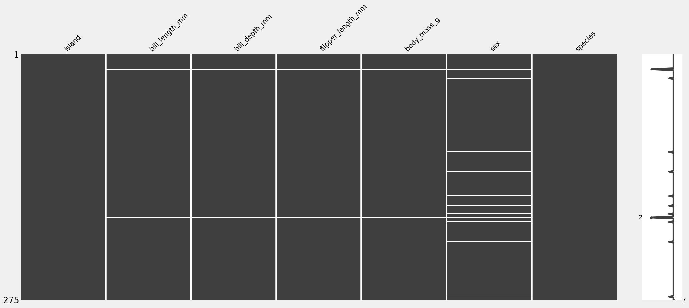
    


Man sieht in der MSNO Matrix, dass bei denselben zwei Datenpunkten nicht nur alle vier numerischen Messungen fehlen, sondern auch das Geschlecht. Daher würde ich diese Datenpunkte einfach droppen.

In der Produktion und für Test Daten, falls da auch fehlenden Werten kommen sollten (wissen wir noch nicht), könnte man das über eine *Fallback-Logik* abfangen: Fehlen alle Hauptfeatures, gibt das Modell direkt die *Majoritätsklasse* zurück, in unserem Fall `Adelie`, was immerhin bei 44.15% der Fälle korrekt wäre (da ist natürlich wichtig, dass man das transparent den Stakeholdern kommuniziert, wie die Logik im Hintergrund funktioniert). Dadurch vermeiden wir, dass durch irgendeine Imputierung potenziell unrealistische Werte ins Modell gelangen.

Hinweis:
Alternativ könnte man versuchen, anhand der Insel die bedingte Wahrscheinlichkeit für die Art zu schätzen oder im Preprocessing einen *KNNImputer* einsetzen, um fehlende Werte durch einigermaßen "realistische" Werte zu ersetzen. Da es sich aber nur um zwei Datenpunkte handelt (rund 0.727% des Datensatzes), lohnt sich dieser Aufwand praktisch nicht.

Jetzt fehlen nur noch Geschlecht Werte von 11 Datenpunkten, um die kümmern wir uns später.

# EDA

Wir versuchen zunächst komplett manuell (visuell) die Klassen zu trennen und schauen ob wir überhaupt ML brauchen werden (Wir gehen davon aus dass wir nicht brauchen) 


```python
g = sns.pairplot(df, hue='species', diag_kind='kde', height=3, aspect=1.5);
g.map_upper(sns.regplot, scatter=False);
```


    
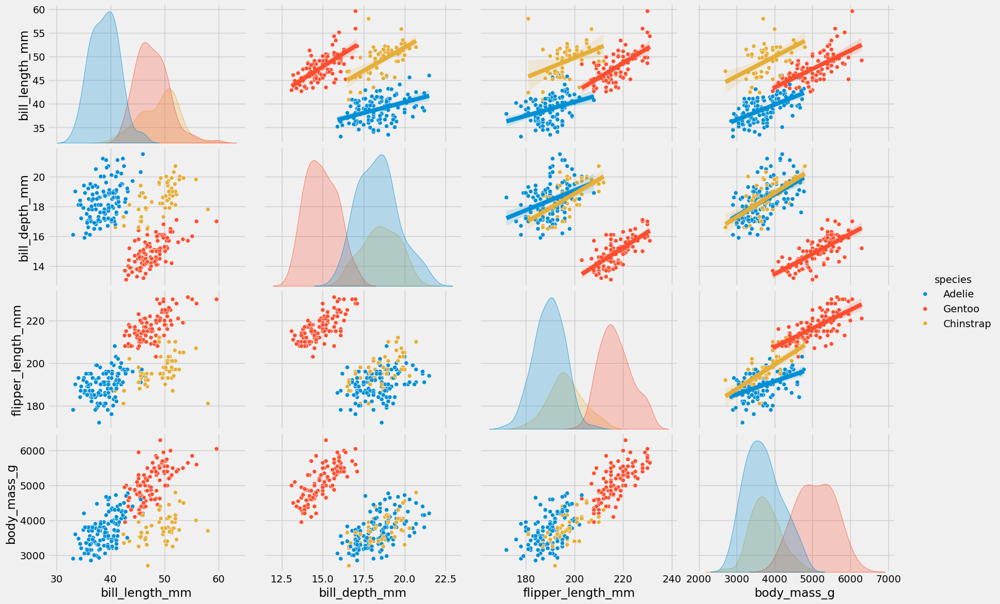
    


Wir sehen, dass `bill_length_mm` allein schon eine ziemlich gute Trennung zwischen allen drei Arten ermöglicht. Bei den anderen Merkmalen, in denen keine `bill_length_mm` vorkommt, lässt sich zwar die Art `Gentoo` weiterhin gut unterscheiden, aber `Adelie` und `Chinstrap` überlappen stark.

Aus dieser Grafik können wir daher bereits vermuten, dass `bill_length_mm` ein besonders wichtiges Feature sein wird. Was wir an dieser Stelle jedoch noch nicht wissen, ist, mit welchen weiteren Merkmalen (`body_mass_g`, `flipper_length_mm`, `bill_depth_mm`) sich `bill_length_mm` am sinnvollsten kombinieren lässt, um eine möglichst robuste und generalisierbare Trennschärfe zu erreichen.

Auf dem Hauptdiagonal ist zu sehen, dass die Features gegeben Labels ungefähr normalverteilt sind.

Auch die kategorialen Variablen `sex` und `island` haben wir in dieser Darstellung noch nicht berücksichtigt.


```python
fig, axes = plt.subplots(1, 3, figsize=(15, 4))
sns.scatterplot(data=df, x='bill_length_mm', y='bill_depth_mm', hue='species', ax=axes[0]);
axes[0].set_title('Bill Length vs Bill Depth');
sns.scatterplot(data=df, x='bill_length_mm', y='flipper_length_mm', hue='species', ax=axes[1]);
axes[1].set_title('Bill Length vs Flipper Length');
axes[1].legend_.remove();
sns.scatterplot(data=df, x='bill_length_mm', y='body_mass_g', hue='species', ax=axes[2]);
axes[2].set_title('Bill Length vs Body Mass');
axes[2].legend_.remove();
plt.tight_layout();
plt.show()
```


    
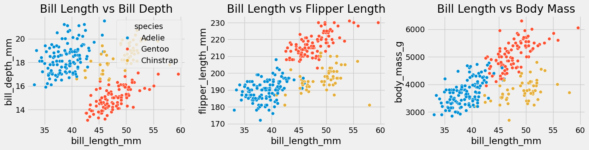
    


`bill_length_mm` hier nochmal genauer angeschaut.


```python
fig, axes = plt.subplots(1, 2, figsize=(15, 4))
pd.crosstab(df.island, df.species).plot.bar(stacked=True, ax=axes[0]);
axes[0].set_title('Species by Island');
pd.crosstab(df.sex, df.species).plot.bar(stacked=True, ax=axes[1]);
axes[1].set_title('Species by Sex');
```


    
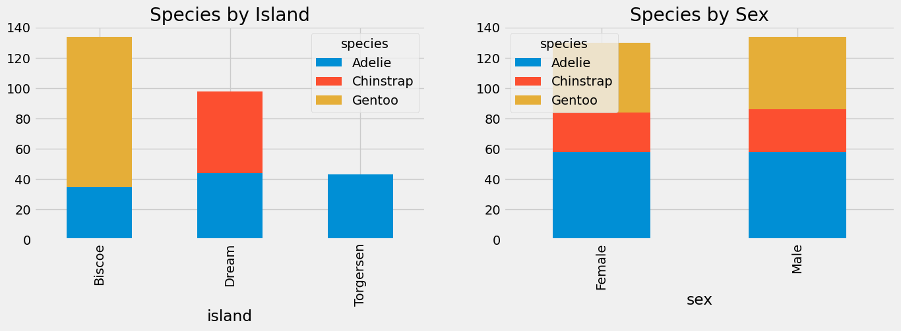
    


**Grafik links**  
Bisher fehlte uns ein Überblick über die kategorialen Features `island` und `sex`.  
In der linken Grafik sieht man bereits einige interessante Muster für `island`:

- Auf der Insel `biscoe` kommt *keine* `Adelie` vor  
  →  $\text{Biscoe} \Rightarrow \neg \text{Adelie}$
- Auf der Insel `dream` kommt *keine* `Gentoo` vor  
  →  $\text{Dream} \Rightarrow \neg \text{Gentoo}$
- Auf der Insel `torgersen` findet man *nur* `Adelie`  
  →  $\text{Torgersen} \Rightarrow \text{Adelie}$

**Wichtig:**  
Hier darf man keinen logischen Umkehrschluss ziehen.
Die Aussagen oben heißen *nicht*, dass man aus der Insel auf die Art schließen könnte:

- `Adelie` kommt auf **allen** Inseln vor, also kann man sie nicht anhand der Insel vorhersagen.  
- `Chinstrap` und `Gentoo` treten zwar jeweils nur auf einer Insel auf, aber dort gibt es **auch** `Adelie`.  

Man kann also auch sie nicht eindeutig bestimmen.

Kurz gesagt: Nur wenn `island = torgersen`, wissen wir sicher, dass die Art `Adelie` ist. 
Dabei ist zu beachten, dass wir natürlich die Vorhersage *von* `island` *auf* `species` betrachten und nicht andersrum.

Hochstens ist diese Variable sehr nutzlich aussieht aber wir wissen noch nicht wie sie sich zusammen mit den anderen Variablen verhält.

**Grafik rechts**  
Bei der Variable `sex` fällt auf, dass die Verteilungen für alle Arten **exakt gleich** sind. Jede Art hat **genau** dieselbe Anzahl an männlichen und weiblichen Vögeln. Das bedeutet, dass `sex` **vollständig unabhängig** von der Art ist und somit **keine Information** zur Vorhersage von `species` enthält.

$$ \Rightarrow P(\text{species} | \text{sex}) = P(\text{species})$$

`sex` ist wahr. daher eine *Kontrollvariable*. D.h. sie wurde so erhoben, dass in allen Gruppen die Geschlechterverteilung konstant bleibt. Aber Achtung nur weil die Variable kein direktes Zusammenhang mit der Zielvariable hat, heißt es nicht, dass er auch die anderen Variablen nicht bei der Vorhersage helfen kann, wir haben also noch nicht ihre Zusammenhang mit anderen Features geprüft, deshalb lassen wir sie vorerst im Datensatz.


```python
sns.relplot(x='bill_length_mm', 
            y='bill_depth_mm', 
            data=df, 
            hue='species', 
            col='island', 
            height=3, 
            aspect=1.5, 
            size='body_mass_g',
            row='sex',
            sizes=(20, 200));
```


    
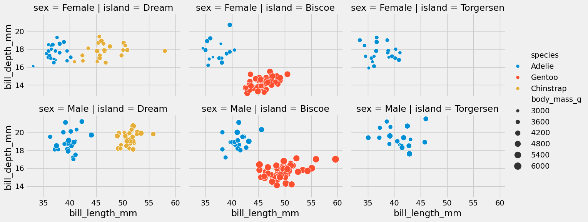
    


```python
sns.relplot(x='bill_length_mm', 
            y='flipper_length_mm', 
            data=df, 
            hue='species', 
            col='island', 
            height=3, 
            aspect=1.5, 
            size='body_mass_g',
            row='sex',
            sizes=(20, 200));
```


    
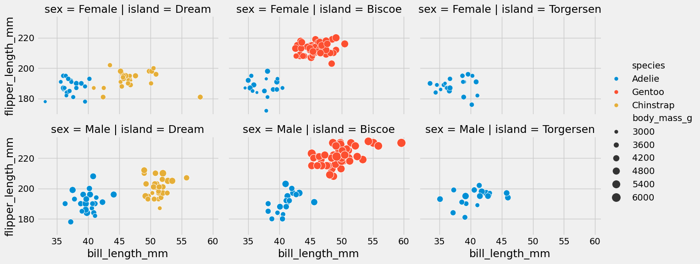
    


Hier können wir 6 Dimensionen in einem Plot sehen:
- `sex` in Zeilen
- `island` in Spalten
- `bill_length_mm` auf der x-Achse
- `bill_depth_mm` bzw. `flipper_length_mm` auf der y-Achse
- `body_mass_g` als die Punktgröße
- `species` als Farbe 

Hier sehen wir ganz eindeutig, dass Geschlecht gar keine Aussagekraft hat sogar im Präsenz auf vielen anderen Variablen. Außerdem ist es auch schwer zu erkennen, dass `body_mass_g` irgendeinen Einfluss hat.

In diesen 2 Grafik, können wir eigentlich alle unseren Features gut sehen. Es lässt sich sagen, dass in Präsenz von `bill_length_mm` und `bill_depth_mm` bzw. `flipper_length_mm`, die Variable `geschlecht` gar nicht bringt und `body_mass_g` kaum etwas. Für `island` ist es immer noch schwer zu sagen, wie viel er beiträgt bzw. ob dieses Feature über andere Features Vorrang hätte.

Also unsere potenzielle Features sind daher: `bill_length_mm`, `bill_depth_mm`, `flipper_length_mm` und `island`. Wir wissen, dass wir eigentlich nur diese brauchen werden, wir wissen noch nicht, wie viele und welche genau.


```python
fig = px.scatter_3d(
    df,
    x='bill_length_mm',
    y='bill_depth_mm',
    z='flipper_length_mm',
    color='species',
    size=df['island'].astype('category').cat.codes + 1,
    symbol='island'
)
fig.show()
```


Wir haben hier versucht, ein 3d Plot mit unseren potenziellen Features nämlich zu visualisieren. Da sieht man, dass im Präsenz von `bill_length_mm`, `bill_depth_mm` und `flipper_length_mm` bringt eigentlich `island` gar nichts was nützliches. Also wir haben jetzt nur 3 potenzielle Features.


```python
num_corr_heatmap(df[['bill_length_mm', 'bill_depth_mm', 'flipper_length_mm', 'body_mass_g']].corr())
```


    
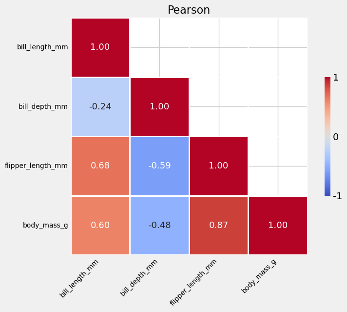
    


Nur aus interesse schaue ich mir die Pearsons Korrelationsmatrix für die numerischen Features an. Da wird sofort klar, warum `body_mass_g` keine Vorhersagekraft hat im Präsenz von anderen Features, weil es sehr stark mit `flipper_length_mm` zusammenhängt. Außerdem hängt es ziemlich stark auch mit `bill_length_mm` zusammen. Also würde man nicht erwarten, dass es im Präsenz von den beiden überhaupt etwas "neue" Informationen liefert.

Wa aber sehr interessant ist, ist die Korrelation zwischen `flipper_length_mm` und `bill_length_mm`, was moderat stark ist. D.h. die haben tatsächlich sehr viel gemeinsam und tragen zusammen nicht (unbedingt) sehr viel bei, im Präsenz von dem anderen. Das lässt mich glauben, dass die Kombination von `bill_length_mm` mit `bill_depth_mm` besser passen würde, wenn ich unbedingt nur für 2 Features entscheiden muss.


```python
cramers_v = cramers_v_matrix(df)
cat_corr_heatmap(cramers_v);
```


    
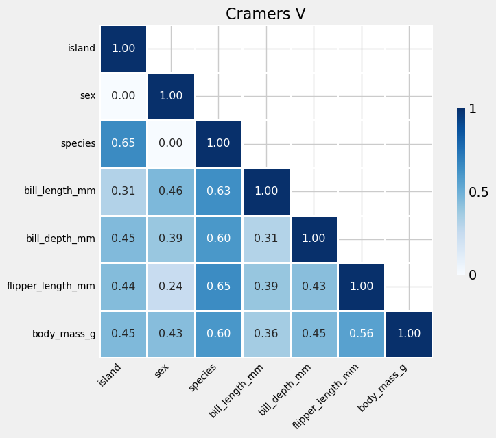
    


In Cramers V Matrix sieht man, dass `sex` gar nicht mit der Zielvariable zusammenhängt, was wir bereits vorher erkannt haben.


```python
fig, axes = plt.subplots(1, 2, figsize=(15, 4))

sns.scatterplot(
    data=df.assign(bill_prop=(df['bill_length_mm'] / df['bill_depth_mm'])),
    x='bill_prop',
    y='flipper_length_mm',
    hue='species',
    ax=axes[0]
)
axes[0].set_title('Bill Ratio vs Flipper Length')

sns.scatterplot(
    data=df.assign(length_ratio=(df['bill_length_mm'] / df['flipper_length_mm'])),
    x='length_ratio',
    y='flipper_length_mm',
    hue='species',
    ax=axes[1]
)
axes[1].set_title('Bill Ratio vs Flipper Length')
plt.show()
```


    
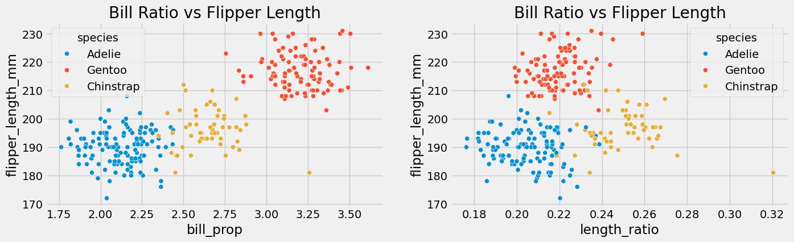
    


Ich habe versucht, zwei neue Features zu erzeugen, nämlich:
- `bill_prop`: Verhätlnis von Schnabellänge zu Schnabelbereite
- `length_ratio`: Verhältnis zwischen Schnabellänge und Flipperlänge

und die beiden Features gegen dem 3. Feature geplottet. Da sieht man aber eindeutige Verbesserung. D.h. obwohl diese Features inhaltlich Sinn machen würden, haben sie keine zusätzliche Vorhersagekraft. 


```python
sns.kdeplot(
    data=df,
    x='bill_length_mm',
    y='bill_depth_mm',
    hue='species',
    fill=True,
    alpha=0.5,
    thresh=0.05,
    levels=100
);
```


    
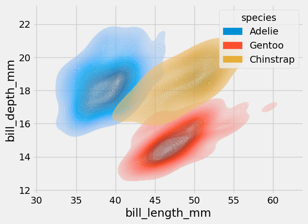
    


Hier sieht man dass die Features nicht nur als Einzelne normalverteilt sind, sondern auch zusammen bivariate normalverteilt sind. Das wäre eine gute Voraussetzung für Gaussian Naive Bayes Klassifikation zu verwenden.


```python
x = df['bill_length_mm'].dropna()
y = df['bill_depth_mm'].dropna()

kde = gaussian_kde([x, y])

xmin, xmax = x.min(), x.max()
ymin, ymax = y.min(), y.max()

xx, yy = np.mgrid[xmin:xmax:100j, ymin:ymax:100j]
positions = np.vstack([xx.ravel(), yy.ravel()])
zz = kde(positions).reshape(xx.shape)

fig = go.Figure(data=[
    go.Surface(
        x=xx,
        y=yy,
        z=zz,
        colorscale="Viridis"
    )
])

fig.update_layout(
    title="3D KDE Surface der Verteilung",
    scene=dict(
        xaxis_title="bill_length_mm",
        yaxis_title="bill_depth_mm",
        zaxis_title="density"
    ),
    height=600
)

fig.show()
```


Hier sieht man die bivariate Normalverteilungen noch einmal genauer an.


```python
show_outliers(df.bill_depth_mm), show_outliers(df.flipper_length_mm)
```


    (Series([], Name: bill_depth_mm, dtype: float64),
     Series([], Name: flipper_length_mm, dtype: float64))


Wir haben also kein Ausreißer!

Naive Bayes Klassifikator könnte in dieser Anwendung sehr sinnvoll sein für folgenden Gründen:

1. Features sind stetig
2. Features sind (ungefähr) normalverteilt
3. White Box Modell, transparent, sehr einfach zu interpretieren und in der Praxis anzuwenden
4. Hat solide theoretische Grundlagen aus der Wahrscheinlichkeitstheorie
5. Sehr schnell im Inferenz

GNB hat aber auch einen starken Nachteil:

1. Naive Annahme, dass die Features gegeben Labels unabhängig sind

Wir verwenden zunächst die zwei Features `bill_length_mm` und `bill_depth_mm`, die wir aus dem EDA am besten gefunden haben.


```python
X, y = pipeline(df, features=['bill_length_mm', 'bill_depth_mm'])
```


```python
gnb = GaussianNB(priors=[1/3, 1/3, 1/3])
cv = loocv(gnb, X, y, metrics=['accuracy'], train_score=True)
print_cv(cv)
```

    test_accuracy: 0.9414 ± 0.2349
    train_accuracy: 0.9450 ± 0.0007


A-Priori 1/3 heißt wir nehmen an, dass alle Klassen gleich Wahrscheinlich sind im Gegensatz zu ihren jeweiligen Häufigkeiten. Meine Annahme ist darin, nur weil eine bestimmte Art mehr Messungen hat, heißt es *nicht*, dass sie auch in der Realität ofters vorkommen.

Ich benutze für Evaluation Leave-One-Out CV, da ich sowieso nicht so viele Datenpunkte habe und damit ein sehr genaurer Schätzer bekommen kann. Auf jeden Fall sind die Accuracy für beide Train und LOOCV Validation ungefähr gleich und ziemlich hoch. Die Standardabweichung für Validation ist auch hoch. Daraus können wir folgendes schließen:

- GNB passt zu den Daten sehr gut, gut generalisiert und nicht viel steuert. Damit ist dieses Modell nicht nur als Baismodell sehr gut geeignet, sondern hat auch das Potenziell wirklich deployed zu werden.

Anmerkung: In LOOCV braucht man keine andere Klassifikationsmetriken wie F1, Precision oder Recall, da sie immer genau das gleiche messen, was bereits Accuracy mist, weil wir nur an einem Datenpunkt testen.

Es gibt 2 Möglichkeiten, wenn nur einen Datenpunkt getestet wird:

1. Der Datenpunkt ist richtig vorhergesagt => Accuracy = 1, Macro Precision = 1, Macro Recall = 1 => Macro F1 = 1
2. Der Datenpunkt ist falsch vorhergesagt => Accuracy = 0, Macro Precision = 0, Macro Recall = 0 => Macro F1 = 0


```python
df_cv = pd.DataFrame({
    "accuracy_train": cv["train_accuracy"],
    "accuracy_test": cv["test_accuracy"],
})
df_cv.head()
```


<div>
<style scoped>
    .dataframe tbody tr th:only-of-type {
        vertical-align: middle;
    }

    .dataframe tbody tr th {
        vertical-align: top;
    }

    .dataframe thead th {
        text-align: right;
    }
</style>
<table border="1" class="dataframe">
  <thead>
    <tr style="text-align: right;">
      <th></th>
      <th>accuracy_train</th>
      <th>accuracy_test</th>
    </tr>
  </thead>
  <tbody>
    <tr>
      <th>0</th>
      <td>0.944853</td>
      <td>1.0</td>
    </tr>
    <tr>
      <th>1</th>
      <td>0.944853</td>
      <td>1.0</td>
    </tr>
    <tr>
      <th>2</th>
      <td>0.944853</td>
      <td>1.0</td>
    </tr>
    <tr>
      <th>3</th>
      <td>0.944853</td>
      <td>1.0</td>
    </tr>
    <tr>
      <th>4</th>
      <td>0.944853</td>
      <td>1.0</td>
    </tr>
  </tbody>
</table>
</div>


```python
df_cv["fold"] = df_cv.index

plt.figure(figsize=(12,5))
sns.lineplot(data=df_cv, x="fold", y="accuracy_train", label="Train Accuracy")
sns.lineplot(data=df_cv, x="fold", y="accuracy_test", label="Validation Accuracy")
plt.title("CV-Score pro Fold (LOOCV)")
plt.ylabel("Score")
plt.show()
```


    
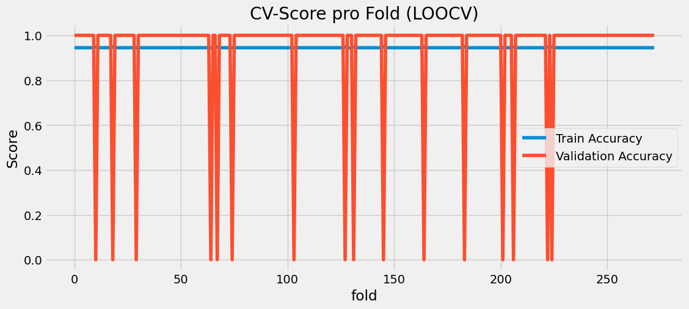
    


Hier sehen wir genau das gleiche, train_accuracy bleibt stabil, test_accuracy schwankt zwischen 1 und 0. Das ist kein Bug, das ist ein Nebeneffekt von LOOCV.


```python
X, y = pipeline(df, features=['bill_length_mm', 'bill_depth_mm'])

cont, ax = plot_decision_surface(
    X, y,
    model=gnb,
    model_name="Naive Bayes",
    which_points="train",
    manual=False
)

fig = ax.get_figure()
fig.colorbar(cont, ax=ax, label="max. Vorhersagewahrscheinlichkeit")
plt.show()
```


    
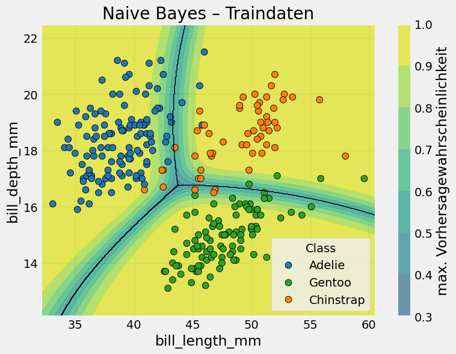
    


Entscheidungsgrenze für Naive Bayes mit Wahrscheinlichkeitskala. Hier sehen wir, dass die Punkte, die ganz weit weg von der Entscheidungsgrenze sind, sind sehr einfach vorherzusagen. Modell hat nur Unsicherheiten um herum der Grenze. Man sieht auch dass `Chinstrap` wird gemischt mit den anderen Klassen. Bei dem Bereich von ([55-60], [17-18]) sieht man ein typisches Verhalten für Naive Bayes. Die Wahrscheinlichkeit in diesem Bereich ist um die 1 für Chinstrap, obwohl hier teilweise mehr Punkte für `Gentoo` vorhanden sind als für `Chinstrap`. Das hat den Grund, dass wir die Normalverteilung für jede Klasse angenommen haben, was impliziert dass die Punkte weit weg von dem Mittelwert sehr unwahrscheinlich sind, deswegen, sind diese `Gentoo` Punkte komplett von dem Modell ignoriert, weil das Modell denkt, es ist einfach nicht Möglich, dass in diesem Bereich ein `Gentoo` fällt wenn der Mittelwert so weit weg ist.


```python
k = 5
cv = skfcv(gnb, X, y, random_seed=RANDOM_SEED, k=k)
print_cv(cv["cv"])
plot_confusion_matrix(cv["cm"], classes=np.unique(y), title=f'Confusion Matrix (Stratified {k}-Fold CV)')
```

    test_accuracy: 0.9451 ± 0.0258
    test_f1_macro: 0.9309 ± 0.0332
    test_precision_macro: 0.9324 ± 0.0351
    test_recall_macro: 0.9317 ± 0.0336


    
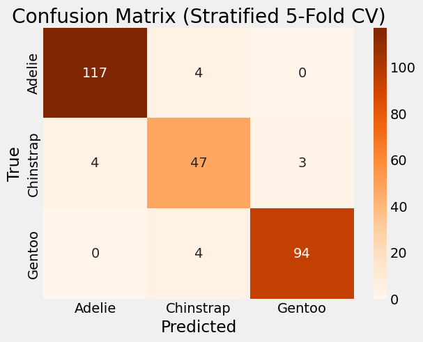
    


Da wir wegen LOOCV keine richtige Modellverhalten sehen können sondern nur Accuracy (aber dafür sehr genau), machen wir einmal stratifizierte Kreuzvalidierung, um einmal Precision, Recall und Konfusionsmatrix auswerten zu können.

Die Precision und Recall liegen sehr nah bei einander, d.h. unser Modell hat keinen systematischen Bias für falsche Positiven oder Negativen. In der Konfusionsmatrix sehen wir genau das gleiche, was wir auch in Entscheidungsgrenze gesehen haben: `Chinstrap` Penguine sind für das Modell schwer zu unterscheiden und werden mit den anderen Vermischt. Modell hat kein Problem zwischen `Gentoo` und `Adelie` zu unterscheiden.

# kNN

Für ein Klassifikationsproblem mit wenigen numerischen Features ist es oft sinnvoll einmal kNN auszuprobieren. Das Modell funktioniert erstaunlich gut, obwohl das so einfach ist, dass es mit sehr komplexeren Modellen konkurrieren kann und das alles ohne jegliche Annahme, außer dass die Features gut skaliert sind (wenn nicht kann man immer selber skalieren). kNN geht davon aus: "ähnliche Labels haben ähnliche Features". Wenn man mit dieser Aussage übereinstimmt, kann man kNN sinnvoll anwenden. kNN hat vor allem einen großen Nachteil, es funktioniert sehr schlecht in höheren Dimensionen (Curse of Dimensionality), aber in unserem Fall ist es nicht der Fall.


```python
df.head()
```


<div>
<style scoped>
    .dataframe tbody tr th:only-of-type {
        vertical-align: middle;
    }

    .dataframe tbody tr th {
        vertical-align: top;
    }

    .dataframe thead th {
        text-align: right;
    }
</style>
<table border="1" class="dataframe">
  <thead>
    <tr style="text-align: right;">
      <th></th>
      <th>island</th>
      <th>bill_length_mm</th>
      <th>bill_depth_mm</th>
      <th>flipper_length_mm</th>
      <th>body_mass_g</th>
      <th>sex</th>
      <th>species</th>
    </tr>
  </thead>
  <tbody>
    <tr>
      <th>98</th>
      <td>Dream</td>
      <td>33.1</td>
      <td>16.1</td>
      <td>178.0</td>
      <td>2900.0</td>
      <td>Female</td>
      <td>Adelie</td>
    </tr>
    <tr>
      <th>114</th>
      <td>Biscoe</td>
      <td>39.6</td>
      <td>20.7</td>
      <td>191.0</td>
      <td>3900.0</td>
      <td>Female</td>
      <td>Adelie</td>
    </tr>
    <tr>
      <th>118</th>
      <td>Torgersen</td>
      <td>35.7</td>
      <td>17.0</td>
      <td>189.0</td>
      <td>3350.0</td>
      <td>Female</td>
      <td>Adelie</td>
    </tr>
    <tr>
      <th>303</th>
      <td>Biscoe</td>
      <td>50.0</td>
      <td>15.9</td>
      <td>224.0</td>
      <td>5350.0</td>
      <td>Male</td>
      <td>Gentoo</td>
    </tr>
    <tr>
      <th>343</th>
      <td>Biscoe</td>
      <td>49.9</td>
      <td>16.1</td>
      <td>213.0</td>
      <td>5400.0</td>
      <td>Male</td>
      <td>Gentoo</td>
    </tr>
  </tbody>
</table>
</div>


```python
features = ['bill_length_mm', 'bill_depth_mm', 'flipper_length_mm']

knn = Pipeline(steps=[
    ('scaler', StandardScaler()),
    ('clf', KNeighborsClassifier(n_neighbors=3))
])
```

Ich nehme zunächst 3 potenzielle Features `bill_length_mm`, `bill_depth_mm` und `flipper_length_mm`. Skaliere sie mit den StandardScaler() "Standadiziert mit 0 Mean und 1 Standardabweichung". Ich verwende zuerst k = 3 Nachbarn (willkürlich), nur um das Pipeline zu erzeugen.


```python
X, y = pipeline(df, features=features)
accuracy_scores_train = []
accuracy_scores_test = []
f1_scores_train = []
f1_scores_test = []
max_k = 50
k_neighbours = range(1, max_k + 1)
for k in k_neighbours:
    knn.set_params(clf__n_neighbors=k)
    cv = skfcv(knn, X, y, k=10, metrics=['accuracy', 'f1_macro'], train_score=True, random_seed=RANDOM_SEED, cm=False)['cv']
    accuracy_scores_train.append(np.mean(cv['train_accuracy']))
    accuracy_scores_test.append(np.mean(cv['test_accuracy']))
    f1_scores_train.append(np.mean(cv['train_f1_macro']))
    f1_scores_test.append(np.mean(cv['test_f1_macro']))
```

Hier mache ich Stratified CV für k zwischen 1 und 50, um das beste zu finden.


```python
plt.figure(figsize=(20, 6))
plt.plot(k_neighbours, accuracy_scores_train, label='Train Accuracy')
plt.plot(k_neighbours, accuracy_scores_test, label='Test Accuracy')
plt.plot(k_neighbours, f1_scores_train, label='Train F1 Macro', linestyle='--')
plt.plot(k_neighbours, f1_scores_test, label='Test F1 Macro', linestyle='--')
plt.xticks(range(1, max_k + 1))
plt.xlabel('k')
plt.ylabel('Score')
plt.title('k Neighbors')
plt.legend()
plt.show()
```


    
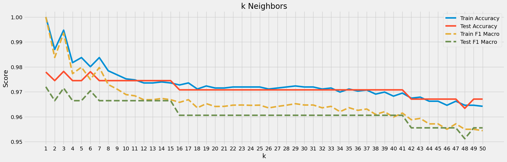
    


```python
max_k = 20
plt.figure(figsize=(10, 6))
plt.plot(k_neighbours[:max_k], accuracy_scores_train[:max_k], label='Train Accuracy')
plt.plot(k_neighbours[:max_k], accuracy_scores_test[:max_k], label='Test Accuracy')
plt.plot(k_neighbours[:max_k], f1_scores_train[:max_k], label='Train F1 Macro', linestyle='--')
plt.plot(k_neighbours[:max_k], f1_scores_test[:max_k], label='Test F1 Macro', linestyle='--')
plt.axvline(x=15, color='gray', linestyle=':')
plt.xticks(range(1, max_k + 1))
plt.xlabel('k')
plt.ylabel('Score')
plt.title('k Neighbors')
plt.legend()
plt.show()
```


    
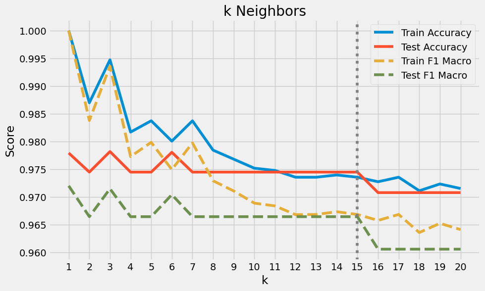
    


Der Test Accuracy bleibt stabil zwischen 7 und 15, ich würde dann eher 15 nehmen, da 15 besser generalisiert. Allgemein für k in kNN gilt, je großer k, desto besser generalisierung, je kleiner k, desto mehr overfitting. Deswegen ein großerer k ist immer bevorzugt, solange das Modell nicht underfittet.


```python
knn.set_params(clf__n_neighbors=15)
for feature_set in [['bill_length_mm', 'bill_depth_mm', 'flipper_length_mm'], ['bill_length_mm', 'bill_depth_mm'], ['bill_length_mm', 'flipper_length_mm']]:
    X, y = pipeline(df, features=feature_set)
    cv = loocv(knn, X, y, metrics=['accuracy'], train_score=True)
    print(f"Features: {feature_set}")
    print_cv(cv)
```

    Features: ['bill_length_mm', 'bill_depth_mm', 'flipper_length_mm']
    test_accuracy: 0.9744 ± 0.1581
    train_accuracy: 0.9744 ± 0.0006
    Features: ['bill_length_mm', 'bill_depth_mm']
    test_accuracy: 0.9634 ± 0.1879
    train_accuracy: 0.9669 ± 0.0009
    Features: ['bill_length_mm', 'flipper_length_mm']
    test_accuracy: 0.9524 ± 0.2130
    train_accuracy: 0.9526 ± 0.0011


Jetzt möchte ich das LOOCV Performance für kNN für unterschiedliche Feature Menge anschauen mit dem davor ausgewählten k. Man sieht das beste Performance ist mit allen 3 Features (auch gut generalisiert), dann die Kombination von `bill_length_mm` und `bill_depth_mm` und das schlimmste ist `bill_length_mm` mit `flipper_length_mm`. Die Entscheidung ist damit sehr einfach. Falls unsere Priorität ist bessere Vorhersage, sollten wir alle drei Features nehmen. Falls unsere Priorität ist das Verhalten zu verstehen und dafür so wenig wie Möglich Features benutzen, dann ist die Teilmenge `bill_length_mm` und `bill_depth_mm` ist eine gute Wahl.

Da kNN ein Black Box Modell ist es sinnvoll ein interpretierbares Verfahren zu benutzen, um Features Verhalten zu verstehen. Wir benutze in diesem SHAP Verfahren, da es Modell Agnostisch ist und daher mit kNN ganz gut funktioniert und Modell Verhalten sowohl global als auch lokal gut zeigt.


```python
X, y = pipeline(df, features=['bill_length_mm', 'bill_depth_mm', 'flipper_length_mm'])
knn.fit(X, y)
exactexplainer = shap.ExactExplainer(knn.predict_proba, X, )
explainer = exactexplainer(X)
classes = np.unique(y)
print(f"{classes[0]}")
shap.plots.beeswarm(explainer[:, :, 0])
print(f"{classes[1]}")
shap.plots.beeswarm(explainer[:, :, 1])
print(f"{classes[2]}")
shap.plots.beeswarm(explainer[:, :, 2])
```

    Adelie


    
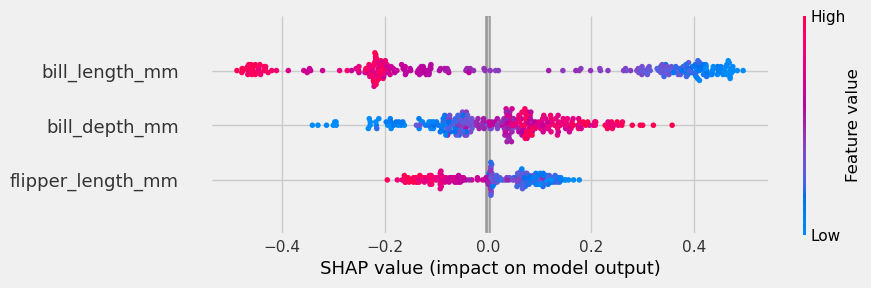
    


    Chinstrap


    
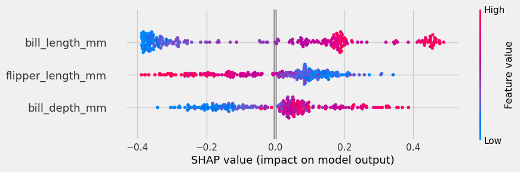
    


    Gentoo


    
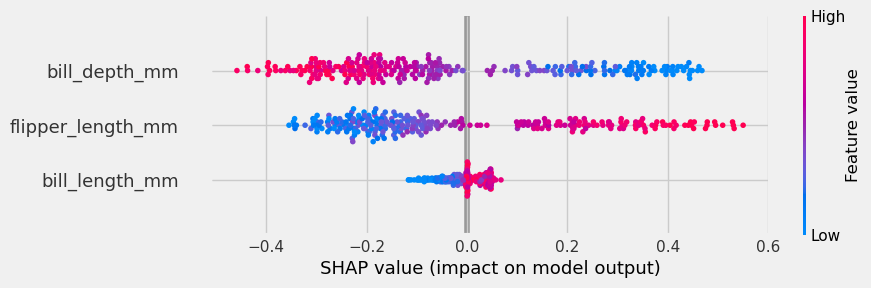
    


Hier sehen wir dass die wichtigste Features in allen 3 Klassen sind entweder `bill_length_mm` und `bill_depth_mm`, wenn wir das Modell mit allen 3 Features verwenden. Das bestätigt unseren Verdacht, dass diese beide Features sind wichtiger sind als `flipper_length_mm`.


```python
k = 10
X, y = pipeline(df, features=['bill_length_mm', 'bill_depth_mm'])
cv = skfcv(knn, X, y, k=k, random_seed=RANDOM_SEED)
print_cv(cv['cv'])
plot_confusion_matrix(cv['cm'], classes=np.unique(y), title=f'Confusion Matrix (Stratified {k}-Fold CV)')
```

    test_accuracy: 0.9636 ± 0.0360
    test_f1_macro: 0.9506 ± 0.0478
    test_precision_macro: 0.9689 ± 0.0369
    test_recall_macro: 0.9417 ± 0.0536


    
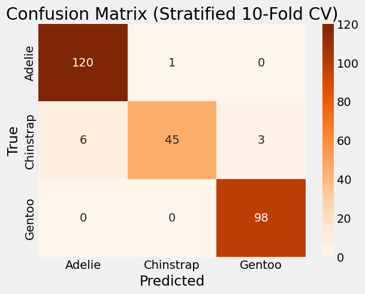
    


In Stratified KV sehen wir unser Modell an sich gut generalisiert. Wir haben sehr gute Validation Accuracy und Precision aber Recall ist ein bisschen Schlechter. D.h wir haben mehr FNs. Das kommt sehr wahrscheinlich aus Chinstrap Klasse, das Modell übersieht diese Klasse eher als falsch zu erkennen. 9 Mal wurde Chinstrap übersehen und nur 1 mal wurde es falsch erkannt. Wir wissen aus Naive Bayes, dass diese Klasse strukturell schwierig zu unterscheiden ist (könnte einfach daran liegen, dass diese Klasse seltener vorkommt "Klassen Ungleichgewicht"). Falls uns wichtig wäre, diese Klasse nicht systematisch zu übersehen, können wir das Modell so anpassen, dass diese Klasse mehr gewichtet wird. Leider gibt es in kNN Modell keine explizite Klassengewichte. Deswegen müssen wir diesen Effekt anhand Klassen Gleichgewichtung erzeugen, in dem wir die `Chinstrap` Punkte oversamplen. Dadurch werden Precision und Recall balanciert bleiben aber in diesem Fall verlieren wir eventuell Genauigkeit und potenzielle schlechtere Generelisierung. Deswegen würde ich trotzdem mit dem gleichen Modell weitergehen.


```python
X, y = pipeline(df, features=['bill_length_mm', 'bill_depth_mm'])
knn.fit(X, y)
cont, ax = plot_decision_surface(
    X, y,
    model=knn,
    model_name="kNN",
    which_points="train",
    manual=False
)

fig = ax.get_figure()
fig.colorbar(cont, ax=ax, label="max. Vorhersagewahrscheinlichkeit")
plt.show()
```


    
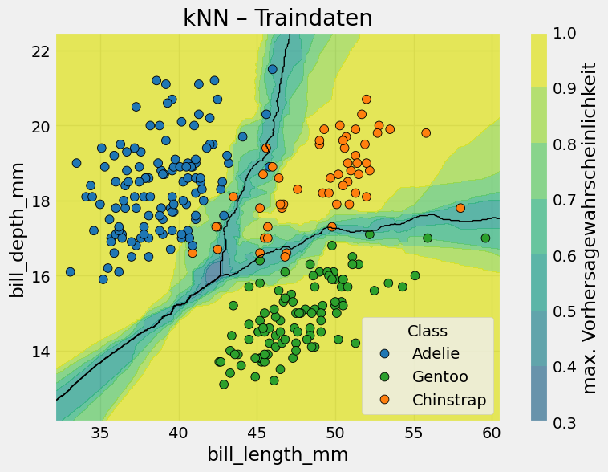
    


Hier sehen wir die Modellgrenze, sie ist nicht so glatt wie GNB aber schneidet trotzdem besser. Vor allem bei den Punkten in den Bereichen ([52:60], [16:18]) und ([45:47], [20:22]). GNB hatte diese Punkte komplett ignoriert. kNN berücksichtigt diese aber mit weniger Sicherheit. Sonst das Problem mit `Chinstrap` FNs wie diskutiert ist eher großer als in GNB. 

# Entscheidungsbaum

Es ist eine Zunde, eine Klassifikationsproblem zu haben und dabei keine Baumbasierte Modelle sich anzuschauen. Da unser Problem sehr einfach ist, würden wir das einfachte Baumbasierte Modell verwenden nämlich ein Entscheidungsbaum (CART). Entscheidungsbaum hat viele Vorteile wie einfache Interpretierbarkeit und schnelle Inferenz. Es hat aber auch ein paar Nachteile wie Overfitting wenn nicht regularisiert, kann nur auf einmal eine einzige Variable trennen (Aches parallel Abschnitte), Gierig (finde der beste Schnitt im Lokal, dabei könnte Global weniger optimierte Lösung raumkommen). 


```python
dtc = DecisionTreeClassifier(
    random_state=RANDOM_SEED,
    criterion='gini', # ['gini', 'entropy'] 
    splitter='best', # ['best' -> bestes Feature + bester Schwellen, 'random' -> zufälliges Feature + bester Schwellen]
    max_depth=None,
    min_samples_split=2, # minimum ist 2
    min_samples_leaf=1, # minimum ist 1
    max_features=None, # Anzahl zufälliger Features, die bei einem Split berücksichtigt werden
    max_leaf_nodes=None
)
dtc
```


<style>#sk-container-id-2 {
  /* Definition of color scheme common for light and dark mode */
  --sklearn-color-text: #000;
  --sklearn-color-text-muted: #666;
  --sklearn-color-line: gray;
  /* Definition of color scheme for unfitted estimators */
  --sklearn-color-unfitted-level-0: #fff5e6;
  --sklearn-color-unfitted-level-1: #f6e4d2;
  --sklearn-color-unfitted-level-2: #ffe0b3;
  --sklearn-color-unfitted-level-3: chocolate;
  /* Definition of color scheme for fitted estimators */
  --sklearn-color-fitted-level-0: #f0f8ff;
  --sklearn-color-fitted-level-1: #d4ebff;
  --sklearn-color-fitted-level-2: #b3dbfd;
  --sklearn-color-fitted-level-3: cornflowerblue;

  /* Specific color for light theme */
  --sklearn-color-text-on-default-background: var(--sg-text-color, var(--theme-code-foreground, var(--jp-content-font-color1, black)));
  --sklearn-color-background: var(--sg-background-color, var(--theme-background, var(--jp-layout-color0, white)));
  --sklearn-color-border-box: var(--sg-text-color, var(--theme-code-foreground, var(--jp-content-font-color1, black)));
  --sklearn-color-icon: #696969;

  @media (prefers-color-scheme: dark) {
    /* Redefinition of color scheme for dark theme */
    --sklearn-color-text-on-default-background: var(--sg-text-color, var(--theme-code-foreground, var(--jp-content-font-color1, white)));
    --sklearn-color-background: var(--sg-background-color, var(--theme-background, var(--jp-layout-color0, #111)));
    --sklearn-color-border-box: var(--sg-text-color, var(--theme-code-foreground, var(--jp-content-font-color1, white)));
    --sklearn-color-icon: #878787;
  }
}

#sk-container-id-2 {
  color: var(--sklearn-color-text);
}

#sk-container-id-2 pre {
  padding: 0;
}

#sk-container-id-2 input.sk-hidden--visually {
  border: 0;
  clip: rect(1px 1px 1px 1px);
  clip: rect(1px, 1px, 1px, 1px);
  height: 1px;
  margin: -1px;
  overflow: hidden;
  padding: 0;
  position: absolute;
  width: 1px;
}

#sk-container-id-2 div.sk-dashed-wrapped {
  border: 1px dashed var(--sklearn-color-line);
  margin: 0 0.4em 0.5em 0.4em;
  box-sizing: border-box;
  padding-bottom: 0.4em;
  background-color: var(--sklearn-color-background);
}

#sk-container-id-2 div.sk-container {
  /* jupyter's `normalize.less` sets `[hidden] { display: none; }`
     but bootstrap.min.css set `[hidden] { display: none !important; }`
     so we also need the `!important` here to be able to override the
     default hidden behavior on the sphinx rendered scikit-learn.org.
     See: https://github.com/scikit-learn/scikit-learn/issues/21755 */
  display: inline-block !important;
  position: relative;
}

#sk-container-id-2 div.sk-text-repr-fallback {
  display: none;
}

div.sk-parallel-item,
div.sk-serial,
div.sk-item {
  /* draw centered vertical line to link estimators */
  background-image: linear-gradient(var(--sklearn-color-text-on-default-background), var(--sklearn-color-text-on-default-background));
  background-size: 2px 100%;
  background-repeat: no-repeat;
  background-position: center center;
}

/* Parallel-specific style estimator block */

#sk-container-id-2 div.sk-parallel-item::after {
  content: "";
  width: 100%;
  border-bottom: 2px solid var(--sklearn-color-text-on-default-background);
  flex-grow: 1;
}

#sk-container-id-2 div.sk-parallel {
  display: flex;
  align-items: stretch;
  justify-content: center;
  background-color: var(--sklearn-color-background);
  position: relative;
}

#sk-container-id-2 div.sk-parallel-item {
  display: flex;
  flex-direction: column;
}

#sk-container-id-2 div.sk-parallel-item:first-child::after {
  align-self: flex-end;
  width: 50%;
}

#sk-container-id-2 div.sk-parallel-item:last-child::after {
  align-self: flex-start;
  width: 50%;
}

#sk-container-id-2 div.sk-parallel-item:only-child::after {
  width: 0;
}

/* Serial-specific style estimator block */

#sk-container-id-2 div.sk-serial {
  display: flex;
  flex-direction: column;
  align-items: center;
  background-color: var(--sklearn-color-background);
  padding-right: 1em;
  padding-left: 1em;
}


/* Toggleable style: style used for estimator/Pipeline/ColumnTransformer box that is
clickable and can be expanded/collapsed.
- Pipeline and ColumnTransformer use this feature and define the default style
- Estimators will overwrite some part of the style using the `sk-estimator` class
*/

/* Pipeline and ColumnTransformer style (default) */

#sk-container-id-2 div.sk-toggleable {
  /* Default theme specific background. It is overwritten whether we have a
  specific estimator or a Pipeline/ColumnTransformer */
  background-color: var(--sklearn-color-background);
}

/* Toggleable label */
#sk-container-id-2 label.sk-toggleable__label {
  cursor: pointer;
  display: flex;
  width: 100%;
  margin-bottom: 0;
  padding: 0.5em;
  box-sizing: border-box;
  text-align: center;
  align-items: start;
  justify-content: space-between;
  gap: 0.5em;
}

#sk-container-id-2 label.sk-toggleable__label .caption {
  font-size: 0.6rem;
  font-weight: lighter;
  color: var(--sklearn-color-text-muted);
}

#sk-container-id-2 label.sk-toggleable__label-arrow:before {
  /* Arrow on the left of the label */
  content: "▸";
  float: left;
  margin-right: 0.25em;
  color: var(--sklearn-color-icon);
}

#sk-container-id-2 label.sk-toggleable__label-arrow:hover:before {
  color: var(--sklearn-color-text);
}

/* Toggleable content - dropdown */

#sk-container-id-2 div.sk-toggleable__content {
  display: none;
  text-align: left;
  /* unfitted */
  background-color: var(--sklearn-color-unfitted-level-0);
}

#sk-container-id-2 div.sk-toggleable__content.fitted {
  /* fitted */
  background-color: var(--sklearn-color-fitted-level-0);
}

#sk-container-id-2 div.sk-toggleable__content pre {
  margin: 0.2em;
  border-radius: 0.25em;
  color: var(--sklearn-color-text);
  /* unfitted */
  background-color: var(--sklearn-color-unfitted-level-0);
}

#sk-container-id-2 div.sk-toggleable__content.fitted pre {
  /* unfitted */
  background-color: var(--sklearn-color-fitted-level-0);
}

#sk-container-id-2 input.sk-toggleable__control:checked~div.sk-toggleable__content {
  /* Expand drop-down */
  display: block;
  width: 100%;
  overflow: visible;
}

#sk-container-id-2 input.sk-toggleable__control:checked~label.sk-toggleable__label-arrow:before {
  content: "▾";
}

/* Pipeline/ColumnTransformer-specific style */

#sk-container-id-2 div.sk-label input.sk-toggleable__control:checked~label.sk-toggleable__label {
  color: var(--sklearn-color-text);
  background-color: var(--sklearn-color-unfitted-level-2);
}

#sk-container-id-2 div.sk-label.fitted input.sk-toggleable__control:checked~label.sk-toggleable__label {
  background-color: var(--sklearn-color-fitted-level-2);
}

/* Estimator-specific style */

/* Colorize estimator box */
#sk-container-id-2 div.sk-estimator input.sk-toggleable__control:checked~label.sk-toggleable__label {
  /* unfitted */
  background-color: var(--sklearn-color-unfitted-level-2);
}

#sk-container-id-2 div.sk-estimator.fitted input.sk-toggleable__control:checked~label.sk-toggleable__label {
  /* fitted */
  background-color: var(--sklearn-color-fitted-level-2);
}

#sk-container-id-2 div.sk-label label.sk-toggleable__label,
#sk-container-id-2 div.sk-label label {
  /* The background is the default theme color */
  color: var(--sklearn-color-text-on-default-background);
}

/* On hover, darken the color of the background */
#sk-container-id-2 div.sk-label:hover label.sk-toggleable__label {
  color: var(--sklearn-color-text);
  background-color: var(--sklearn-color-unfitted-level-2);
}

/* Label box, darken color on hover, fitted */
#sk-container-id-2 div.sk-label.fitted:hover label.sk-toggleable__label.fitted {
  color: var(--sklearn-color-text);
  background-color: var(--sklearn-color-fitted-level-2);
}

/* Estimator label */

#sk-container-id-2 div.sk-label label {
  font-family: monospace;
  font-weight: bold;
  display: inline-block;
  line-height: 1.2em;
}

#sk-container-id-2 div.sk-label-container {
  text-align: center;
}

/* Estimator-specific */
#sk-container-id-2 div.sk-estimator {
  font-family: monospace;
  border: 1px dotted var(--sklearn-color-border-box);
  border-radius: 0.25em;
  box-sizing: border-box;
  margin-bottom: 0.5em;
  /* unfitted */
  background-color: var(--sklearn-color-unfitted-level-0);
}

#sk-container-id-2 div.sk-estimator.fitted {
  /* fitted */
  background-color: var(--sklearn-color-fitted-level-0);
}

/* on hover */
#sk-container-id-2 div.sk-estimator:hover {
  /* unfitted */
  background-color: var(--sklearn-color-unfitted-level-2);
}

#sk-container-id-2 div.sk-estimator.fitted:hover {
  /* fitted */
  background-color: var(--sklearn-color-fitted-level-2);
}

/* Specification for estimator info (e.g. "i" and "?") */

/* Common style for "i" and "?" */

.sk-estimator-doc-link,
a:link.sk-estimator-doc-link,
a:visited.sk-estimator-doc-link {
  float: right;
  font-size: smaller;
  line-height: 1em;
  font-family: monospace;
  background-color: var(--sklearn-color-background);
  border-radius: 1em;
  height: 1em;
  width: 1em;
  text-decoration: none !important;
  margin-left: 0.5em;
  text-align: center;
  /* unfitted */
  border: var(--sklearn-color-unfitted-level-1) 1pt solid;
  color: var(--sklearn-color-unfitted-level-1);
}

.sk-estimator-doc-link.fitted,
a:link.sk-estimator-doc-link.fitted,
a:visited.sk-estimator-doc-link.fitted {
  /* fitted */
  border: var(--sklearn-color-fitted-level-1) 1pt solid;
  color: var(--sklearn-color-fitted-level-1);
}

/* On hover */
div.sk-estimator:hover .sk-estimator-doc-link:hover,
.sk-estimator-doc-link:hover,
div.sk-label-container:hover .sk-estimator-doc-link:hover,
.sk-estimator-doc-link:hover {
  /* unfitted */
  background-color: var(--sklearn-color-unfitted-level-3);
  color: var(--sklearn-color-background);
  text-decoration: none;
}

div.sk-estimator.fitted:hover .sk-estimator-doc-link.fitted:hover,
.sk-estimator-doc-link.fitted:hover,
div.sk-label-container:hover .sk-estimator-doc-link.fitted:hover,
.sk-estimator-doc-link.fitted:hover {
  /* fitted */
  background-color: var(--sklearn-color-fitted-level-3);
  color: var(--sklearn-color-background);
  text-decoration: none;
}

/* Span, style for the box shown on hovering the info icon */
.sk-estimator-doc-link span {
  display: none;
  z-index: 9999;
  position: relative;
  font-weight: normal;
  right: .2ex;
  padding: .5ex;
  margin: .5ex;
  width: min-content;
  min-width: 20ex;
  max-width: 50ex;
  color: var(--sklearn-color-text);
  box-shadow: 2pt 2pt 4pt #999;
  /* unfitted */
  background: var(--sklearn-color-unfitted-level-0);
  border: .5pt solid var(--sklearn-color-unfitted-level-3);
}

.sk-estimator-doc-link.fitted span {
  /* fitted */
  background: var(--sklearn-color-fitted-level-0);
  border: var(--sklearn-color-fitted-level-3);
}

.sk-estimator-doc-link:hover span {
  display: block;
}

/* "?"-specific style due to the `<a>` HTML tag */

#sk-container-id-2 a.estimator_doc_link {
  float: right;
  font-size: 1rem;
  line-height: 1em;
  font-family: monospace;
  background-color: var(--sklearn-color-background);
  border-radius: 1rem;
  height: 1rem;
  width: 1rem;
  text-decoration: none;
  /* unfitted */
  color: var(--sklearn-color-unfitted-level-1);
  border: var(--sklearn-color-unfitted-level-1) 1pt solid;
}

#sk-container-id-2 a.estimator_doc_link.fitted {
  /* fitted */
  border: var(--sklearn-color-fitted-level-1) 1pt solid;
  color: var(--sklearn-color-fitted-level-1);
}

/* On hover */
#sk-container-id-2 a.estimator_doc_link:hover {
  /* unfitted */
  background-color: var(--sklearn-color-unfitted-level-3);
  color: var(--sklearn-color-background);
  text-decoration: none;
}

#sk-container-id-2 a.estimator_doc_link.fitted:hover {
  /* fitted */
  background-color: var(--sklearn-color-fitted-level-3);
}

.estimator-table summary {
    padding: .5rem;
    font-family: monospace;
    cursor: pointer;
}

.estimator-table details[open] {
    padding-left: 0.1rem;
    padding-right: 0.1rem;
    padding-bottom: 0.3rem;
}

.estimator-table .parameters-table {
    margin-left: auto !important;
    margin-right: auto !important;
}

.estimator-table .parameters-table tr:nth-child(odd) {
    background-color: #fff;
}

.estimator-table .parameters-table tr:nth-child(even) {
    background-color: #f6f6f6;
}

.estimator-table .parameters-table tr:hover {
    background-color: #e0e0e0;
}

.estimator-table table td {
    border: 1px solid rgba(106, 105, 104, 0.232);
}

.user-set td {
    color:rgb(255, 94, 0);
    text-align: left;
}

.user-set td.value pre {
    color:rgb(255, 94, 0) !important;
    background-color: transparent !important;
}

.default td {
    color: black;
    text-align: left;
}

.user-set td i,
.default td i {
    color: black;
}

.copy-paste-icon {
    background-image: url();
    background-repeat: no-repeat;
    background-size: 14px 14px;
    background-position: 0;
    display: inline-block;
    width: 14px;
    height: 14px;
    cursor: pointer;
}
</style><body><div id="sk-container-id-2" class="sk-top-container"><div class="sk-text-repr-fallback"><pre>DecisionTreeClassifier(random_state=42)</pre><b>In a Jupyter environment, please rerun this cell to show the HTML representation or trust the notebook. <br />On GitHub, the HTML representation is unable to render, please try loading this page with nbviewer.org.</b></div><div class="sk-container" hidden><div class="sk-item"><div class="sk-estimator  sk-toggleable"><input class="sk-toggleable__control sk-hidden--visually" id="sk-estimator-id-2" type="checkbox" checked><label for="sk-estimator-id-2" class="sk-toggleable__label  sk-toggleable__label-arrow"><div><div>DecisionTreeClassifier</div></div><div><a class="sk-estimator-doc-link " rel="noreferrer" target="_blank" href="https://scikit-learn.org/1.7/modules/generated/sklearn.tree.DecisionTreeClassifier.html">?<span>Documentation for DecisionTreeClassifier</span></a><span class="sk-estimator-doc-link ">i<span>Not fitted</span></span></div></label><div class="sk-toggleable__content " data-param-prefix="">
        <div class="estimator-table">
            <details>
                <summary>Parameters</summary>
                <table class="parameters-table">
                  <tbody>

        <tr class="default">
            <td><i class="copy-paste-icon"
                 onclick="copyToClipboard('criterion',
                          this.parentElement.nextElementSibling)"
            ></i></td>
            <td class="param">criterion&nbsp;</td>
            <td class="value">&#x27;gini&#x27;</td>
        </tr>


        <tr class="default">
            <td><i class="copy-paste-icon"
                 onclick="copyToClipboard('splitter',
                          this.parentElement.nextElementSibling)"
            ></i></td>
            <td class="param">splitter&nbsp;</td>
            <td class="value">&#x27;best&#x27;</td>
        </tr>


        <tr class="default">
            <td><i class="copy-paste-icon"
                 onclick="copyToClipboard('max_depth',
                          this.parentElement.nextElementSibling)"
            ></i></td>
            <td class="param">max_depth&nbsp;</td>
            <td class="value">None</td>
        </tr>


        <tr class="default">
            <td><i class="copy-paste-icon"
                 onclick="copyToClipboard('min_samples_split',
                          this.parentElement.nextElementSibling)"
            ></i></td>
            <td class="param">min_samples_split&nbsp;</td>
            <td class="value">2</td>
        </tr>


        <tr class="default">
            <td><i class="copy-paste-icon"
                 onclick="copyToClipboard('min_samples_leaf',
                          this.parentElement.nextElementSibling)"
            ></i></td>
            <td class="param">min_samples_leaf&nbsp;</td>
            <td class="value">1</td>
        </tr>


        <tr class="default">
            <td><i class="copy-paste-icon"
                 onclick="copyToClipboard('min_weight_fraction_leaf',
                          this.parentElement.nextElementSibling)"
            ></i></td>
            <td class="param">min_weight_fraction_leaf&nbsp;</td>
            <td class="value">0.0</td>
        </tr>


        <tr class="default">
            <td><i class="copy-paste-icon"
                 onclick="copyToClipboard('max_features',
                          this.parentElement.nextElementSibling)"
            ></i></td>
            <td class="param">max_features&nbsp;</td>
            <td class="value">None</td>
        </tr>


        <tr class="user-set">
            <td><i class="copy-paste-icon"
                 onclick="copyToClipboard('random_state',
                          this.parentElement.nextElementSibling)"
            ></i></td>
            <td class="param">random_state&nbsp;</td>
            <td class="value">42</td>
        </tr>


        <tr class="default">
            <td><i class="copy-paste-icon"
                 onclick="copyToClipboard('max_leaf_nodes',
                          this.parentElement.nextElementSibling)"
            ></i></td>
            <td class="param">max_leaf_nodes&nbsp;</td>
            <td class="value">None</td>
        </tr>


        <tr class="default">
            <td><i class="copy-paste-icon"
                 onclick="copyToClipboard('min_impurity_decrease',
                          this.parentElement.nextElementSibling)"
            ></i></td>
            <td class="param">min_impurity_decrease&nbsp;</td>
            <td class="value">0.0</td>
        </tr>


        <tr class="default">
            <td><i class="copy-paste-icon"
                 onclick="copyToClipboard('class_weight',
                          this.parentElement.nextElementSibling)"
            ></i></td>
            <td class="param">class_weight&nbsp;</td>
            <td class="value">None</td>
        </tr>


        <tr class="default">
            <td><i class="copy-paste-icon"
                 onclick="copyToClipboard('ccp_alpha',
                          this.parentElement.nextElementSibling)"
            ></i></td>
            <td class="param">ccp_alpha&nbsp;</td>
            <td class="value">0.0</td>
        </tr>


        <tr class="default">
            <td><i class="copy-paste-icon"
                 onclick="copyToClipboard('monotonic_cst',
                          this.parentElement.nextElementSibling)"
            ></i></td>
            <td class="param">monotonic_cst&nbsp;</td>
            <td class="value">None</td>
        </tr>

                  </tbody>
                </table>
            </details>
        </div>
    </div></div></div></div></div><script>function copyToClipboard(text, element) {
    // Get the parameter prefix from the closest toggleable content
    const toggleableContent = element.closest('.sk-toggleable__content');
    const paramPrefix = toggleableContent ? toggleableContent.dataset.paramPrefix : '';
    const fullParamName = paramPrefix ? `${paramPrefix}${text}` : text;

    const originalStyle = element.style;
    const computedStyle = window.getComputedStyle(element);
    const originalWidth = computedStyle.width;
    const originalHTML = element.innerHTML.replace('Copied!', '');

    navigator.clipboard.writeText(fullParamName)
        .then(() => {
            element.style.width = originalWidth;
            element.style.color = 'green';
            element.innerHTML = "Copied!";

            setTimeout(() => {
                element.innerHTML = originalHTML;
                element.style = originalStyle;
            }, 2000);
        })
        .catch(err => {
            console.error('Failed to copy:', err);
            element.style.color = 'red';
            element.innerHTML = "Failed!";
            setTimeout(() => {
                element.innerHTML = originalHTML;
                element.style = originalStyle;
            }, 2000);
        });
    return false;
}

document.querySelectorAll('.fa-regular.fa-copy').forEach(function(element) {
    const toggleableContent = element.closest('.sk-toggleable__content');
    const paramPrefix = toggleableContent ? toggleableContent.dataset.paramPrefix : '';
    const paramName = element.parentElement.nextElementSibling.textContent.trim();
    const fullParamName = paramPrefix ? `${paramPrefix}${paramName}` : paramName;

    element.setAttribute('title', fullParamName);
});
</script></body>


Wir benutzen zuerst komplett offene Entscheidungsbaum, ohne irgendeine Kontrolle/Regularisierung/Pruning. Um zu schauen wie das Modell aussieht und wo können wir aufhören. Wir benutzen dafür alle drei potenzielle Features. 


```python
X, y = pipeline(df, features=['bill_length_mm', 'flipper_length_mm', 'bill_depth_mm'])
dtc.fit(X, y)
plot_dt(dtc)
```


    
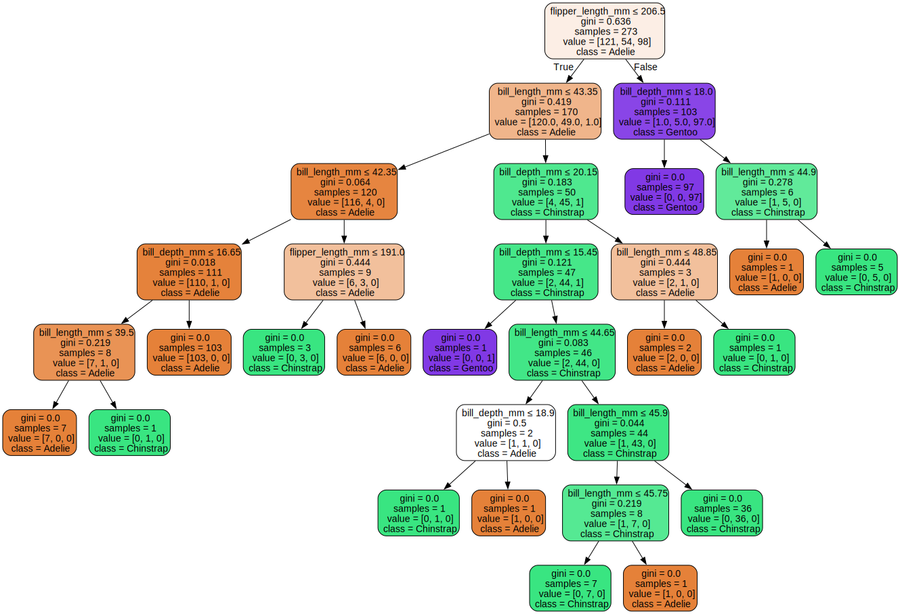
    


Auf dem ersten Blick sieht es so aus, als `flipper_length_mm` das wichtigste Feature wäre, weil da am Ersten gesplittet wird. Auf dem genauer Blick fällt auf, dass der Baum extrem Linksschief, das ist ein Hinweis darauf, dass wir früher einen Split gemacht haben, was global nicht der beste Split war. Das ist genau das Problem mit einem Entscheidungsbaum (Gieriges Algorithm). Jetzt versuchen wir nur mit 2 Features, um der Baum besser aussieht. Ich würde dafür `bill_length_mm` und `bill_depth_mm` verwenden.


```python
X, y = pipeline(df, features=['bill_length_mm', 'bill_depth_mm'])
dtc.fit(X, y)
plot_dt(dtc)
```


    
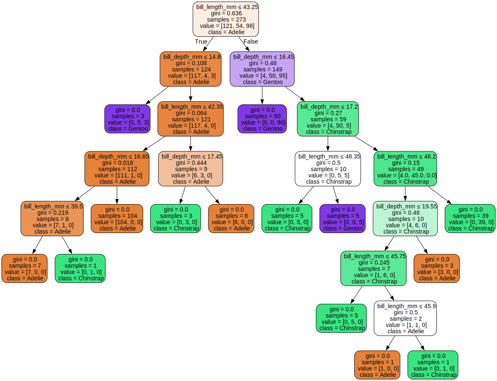
    


Jetzt sieht der Baum viel ausgewogener aus. Das ist bereits ein Zeichen dafür, dass der erste Split nicht nur lokal optimiert sondern einigermaßen global. Hier sehen wir nachdem 4te Ebene, versucht der Baum nur einzelne Punkte zu trennen. Wir sollen auf jeden Fall an dieser Ebene aufhören und dann überlegen ob wir noch früher aufhören könnten und ob wir an einer Ebene alle Splits bräuchten.


```python
dtc.set_params(max_depth=4)
X, y = pipeline(df, features=['bill_length_mm', 'bill_depth_mm'])
dtc.fit(X, y)
plot_dt(dtc)
```


    
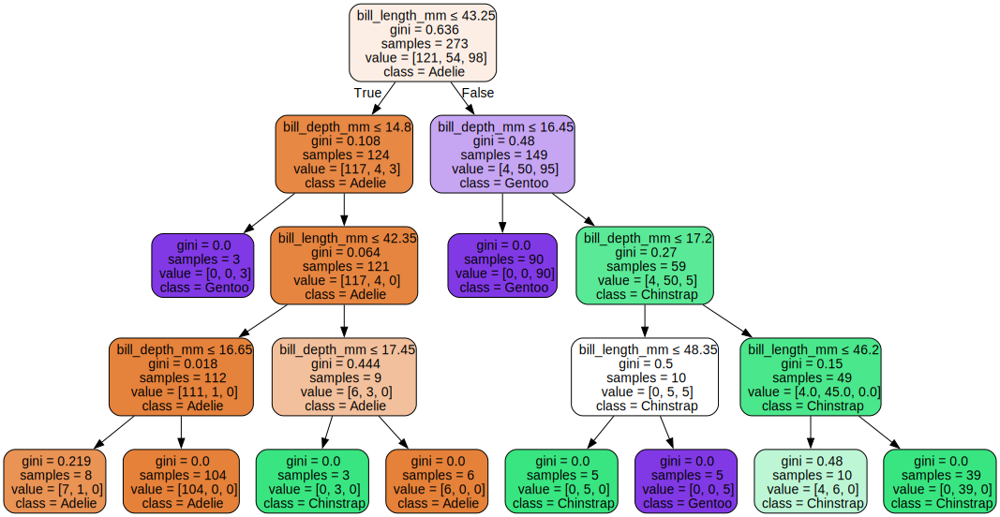
    


Tiefe 2, Blatt 2: Dieser Blatt braucht man weiter zu splitten, da das ist ganz klar `Adelie`, und sogar wenn es weiter gesplittet wird, werden die Klassen immer noch nicht getrennt. Deswegen hier sollte man aufhören.

Tiefe 2, Blatt 4: Hier ebenfalls ist der Split nicht so sinnvoll, da die Klasse eindeutig `Chinstrap` und sogar mit weiteren Splitten die Klassen werden nicht getrennt. Hier ist aber nicht so ganz klar, ob man hier aufhören könnte. Das hängt davon ab, ob die nächsten Splitten Sinnvoll sein könnten.

Tiefe 4, Blatt 7: Wir sehen in supertree, dass für den Baum ist es sehr schwer, diesen Datenpunkte zu trennen, d.h. mit diesen 2 Features ist nicht sinnvoll weiter zu versuchen. Wir schauen, ob wir `flipper_length_mm` verwenden können, um sie zu trennen. Weil sonst können beide sehr gut unterscheiden außer diesen 10 Punkte. Vllt. da könnte dieses Feature helfen.


```python
confusing = df.loc[(df.bill_length_mm <= 46.2) & (df.bill_depth_mm > 17.20) & (df.bill_depth_mm > 16.45) & (df.bill_length_mm > 43.25)]
sns.pairplot(confusing[['bill_length_mm', 'bill_depth_mm', 'flipper_length_mm', 'species']], hue='species', diag_kind='kde');
```


    
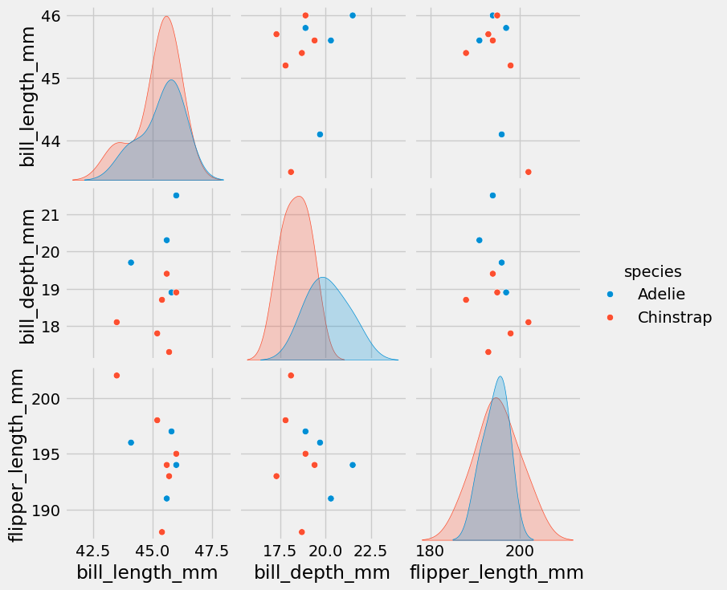
    


Hier sieht man diese 10 Datenpunkte kann man gar nicht anhand `flipper_length_mm` trennen. Wenn überhaupt, dann `bill_depth_mm`. D.h. da `bill_length_mm` und `bill_depth_mm` aufgeben, gib `flipper_length_mm` auch auf.

Da der Split an Tiefe 2 Blatt 4, weiterhin die Punkte nicht richtig trennen kann, zumindest nicht bei weiteren 4 Ebenen, ist es sinnvoll dieser Split zu löschen.

Tiefe 1, Blatt 1: Die letzte Entscheidung ist nur, ob wir dieser Split auch brauchen, er trennt nur 3 `Gentoo` was eigentlich sehr wenig ist für eine Trennung, wenn wir aber ganz genau in SuperTree anschauen, wir sehen dass diese Gentoo ganz klar von den anderen Unterscheiden (sehr große Lücke). D.h. es ist sinnvoll hier zu trennen und es wird keine overfitting geben, weil sie systematisch unterscheiden.


```python
print(export_text(dtc, feature_names=list(X.columns)))
```

    |--- bill_length_mm <= 43.25
    |   |--- bill_depth_mm <= 14.80
    |   |   |--- class: Gentoo
    |   |--- bill_depth_mm >  14.80
    |   |   |--- bill_length_mm <= 42.35
    |   |   |   |--- bill_depth_mm <= 16.65
    |   |   |   |   |--- class: Adelie
    |   |   |   |--- bill_depth_mm >  16.65
    |   |   |   |   |--- class: Adelie
    |   |   |--- bill_length_mm >  42.35
    |   |   |   |--- bill_depth_mm <= 17.45
    |   |   |   |   |--- class: Chinstrap
    |   |   |   |--- bill_depth_mm >  17.45
    |   |   |   |   |--- class: Adelie
    |--- bill_length_mm >  43.25
    |   |--- bill_depth_mm <= 16.45
    |   |   |--- class: Gentoo
    |   |--- bill_depth_mm >  16.45
    |   |   |--- bill_depth_mm <= 17.20
    |   |   |   |--- bill_length_mm <= 48.35
    |   |   |   |   |--- class: Chinstrap
    |   |   |   |--- bill_length_mm >  48.35
    |   |   |   |   |--- class: Gentoo
    |   |   |--- bill_depth_mm >  17.20
    |   |   |   |--- bill_length_mm <= 46.20
    |   |   |   |   |--- class: Chinstrap
    |   |   |   |--- bill_length_mm >  46.20
    |   |   |   |   |--- class: Chinstrap
    


Wenn wir alle zusätzliche Blätter löschen, bekommen wir ein sehr einfaches Entscheidungsbaum:

- Wenn `bill_length_mm` <= 43.25 UND `bill_depth_mm` > 14.8 => `Adelie`
- Wenn `bill_length__mm` > 43.25 UND `bill_depth_mm` > 16.45 => `Chinstrap`
- Sonst => `Gentoo`


```python
X, y = pipeline(df, features=['bill_length_mm', 'bill_depth_mm'])
dtc.fit(X, y)
super_tree = SuperTree(dtc, X, y, dtc.feature_names_in_, dtc.classes_)
super_tree.save_html('supertree.html')
```

    HTML saved to supertree.html


```python
for feature_set in [['bill_length_mm', 'bill_depth_mm', 'flipper_length_mm'], ['bill_length_mm', 'bill_depth_mm'], ['bill_length_mm', 'flipper_length_mm']]:
    X, y = pipeline(df, features=feature_set)
    cv = loocv(dtc, X, y, metrics=['accuracy'], train_score=True)
    print(f"features: {feature_set}")
    print_cv(cv)
```

    features: ['bill_length_mm', 'bill_depth_mm', 'flipper_length_mm']
    test_accuracy: 0.9560 ± 0.2050
    train_accuracy: 0.9890 ± 0.0005
    features: ['bill_length_mm', 'bill_depth_mm']
    test_accuracy: 0.9707 ± 0.1687
    train_accuracy: 0.9816 ± 0.0026
    features: ['bill_length_mm', 'flipper_length_mm']
    test_accuracy: 0.9451 ± 0.2279
    train_accuracy: 0.9780 ± 0.0009


Ich betrachte noch einmal alle frei potenzielle Featuremenge, um sicher zu gehen, dass die Features `bill_length_mm` und `bill_depth_mm` tatsächlich sinnvolle Features sind. Und man sieht ganz klar die Featuremenge `bill_length_mm` und `bill_depth_mm` am besten an LOOCV schneidet. Sogar besser als alle 3 Features zusammen (weil da weniger generalisiert wird und diese erster Split mit `flipper_length_mm` führt zu nicht optimale Lösung). Also was wir visuell rausgefunden haben, zeigt auch die konkreten Zahlen.


```python
X, y = pipeline(df, features=['bill_length_mm', 'bill_depth_mm'])
k = 10
cv = skfcv(dtc, X, y, k=10, random_seed=RANDOM_SEED)
print_cv(cv['cv'])
plot_confusion_matrix(cv['cm'], classes=np.unique(y), title=f'Confusion Matrix (Stratified {k}-Fold CV)')
```

    test_accuracy: 0.9603 ± 0.0466
    test_f1_macro: 0.9516 ± 0.0541
    test_precision_macro: 0.9623 ± 0.0437
    test_recall_macro: 0.9533 ± 0.0533


    
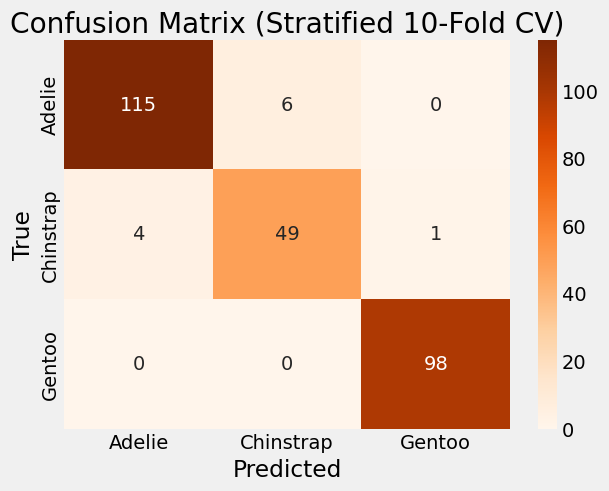
    


Hier schauen wir uns die Ergebnisse aus Stratified KV. Gut generalisiert, kein Precision Recall Problem wie in kNN.


```python
# def manual_rules(row):
#     if row['bill_length_mm'] <= 43.25:
#         if row['bill_depth_mm'] <= 14.8:
#             return 'Gentoo'
#         return 'Adelie'
#     if row['bill_depth_mm'] <= 16.45:
#         return 'Gentoo'
#     return 'Chinstrap'

def manual_rules(row):
    if row['bill_length_mm'] <= 43.25 and row['bill_depth_mm'] > 14.8:
        return 'Adelie'
    if row['bill_length_mm'] > 43.25 and row['bill_depth_mm'] > 16.45:
        return 'Chinstrap'
    return 'Gentoo'
class ManualRuleClassifier(BaseEstimator, ClassifierMixin):

    def fit(self, X, y):
        # Klassen + Spaltennamen speichern
        self.classes_ = np.unique(y)
        self.feature_names_ = X.columns.tolist()
        return self

    def predict(self, X):
        X = self._to_df(X)
        return X.apply(manual_rules, axis=1).values
    
    def _to_df(self, X):
        if isinstance(X, pd.DataFrame):
            return X
        return pd.DataFrame(X, columns=self.feature_names_)

    def predict_proba(self, X):
        X = self._to_df(X)
        preds = self.predict(X)
        class_to_idx = {c: i for i, c in enumerate(self.classes_)}
        proba = np.zeros((len(preds), len(self.classes_)))
        proba[np.arange(len(preds)), [class_to_idx[p] for p in preds]] = 1.0
        return proba

man = ManualRuleClassifier()
```


```python
X, y = pipeline(df, features=['bill_length_mm', 'bill_depth_mm'])
man.fit(X, y)
plot_manual_tree(X, y)
```


    
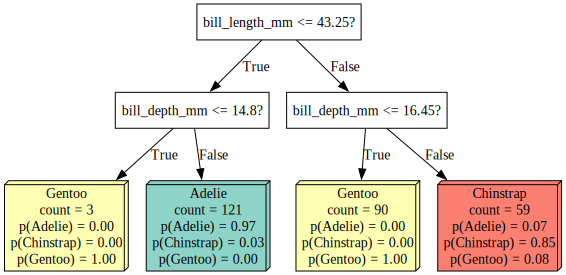
    


So sieht jetzt unser Modell aus. Wurde sehr stark vereinfacht.


```python
cv = loocv(man, X, y, metrics=['accuracy'], train_score=True)
print_cv(cv)
```

    test_accuracy: 0.9524 ± 0.2130
    train_accuracy: 0.9524 ± 0.0008


OK wir verlieren 2% Accuracy an LOOCV im Vergleich zu ohne Vereinfachte Baum mit 4 Ebenen. Das ist schon ein Unterschied, ABER das sind nur unsere Trainingsdaten, unser echtes Ziel sind die Daten in der Zukünft und dieses Modell obwohl weniger genauer, hat höhere Chances besser zu generalisieren. Außerdem ist unser Ziel interpretieren zu können und dieses vereinfaches Baum ist viel einfacher und straight forward zu interpretieren im Vergleich zu dem Baum davor. Deswegen würde ich trotzdem mit dem weitergehen.


```python
k = 10
cv = skfcv(man, X, y, k=k, random_seed=RANDOM_SEED)
print_cv(cv['cv'])
plot_confusion_matrix(cv['cm'], classes=np.unique(y), title=f'Confusion Matrix (Stratified {k}-Fold CV)')
```

    test_accuracy: 0.9526 ± 0.0327
    test_f1_macro: 0.9404 ± 0.0429
    test_precision_macro: 0.9427 ± 0.0388
    test_recall_macro: 0.9459 ± 0.0464


    
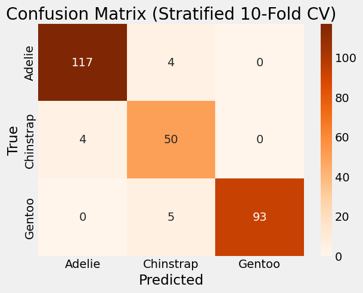
    


Modell hat kein Precision Recall Problem und auch keine Präferenzen für eine bestimmte Klasse. Nur allgemein Schwach für `Chinstrap` Klasse wie in GNB.


```python
X, y = pipeline(df, features=['bill_length_mm', 'bill_depth_mm'])

cont, ax = plot_decision_surface(
    X, y,
    manual=True,
    manual_rules=manual_rules,
    get_leaf_masks=get_leaf_masks,
    model_name="Manuelles Entscheidungsmodell",
    which_points="train"
)
fig = ax.get_figure()
fig.colorbar(cont, ax=ax, label="max. Vorhersagewahrscheinlichkeit")
plt.show()
```


    
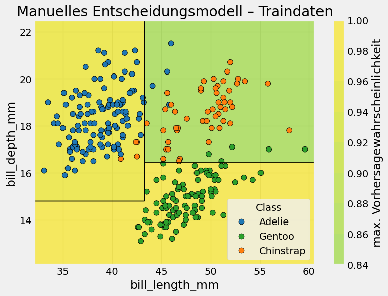
    


In dieser Entscheidungsgrenze haben wir genau das gleiche Problem wie in GNB aber aus unterschiedlichen Gründen. Davor war das Problem ist die Annahme für eine Normalverteilung. Hier ist das Problem ist die Annahme für Achsenparallele Gerade, wenn dieser Baum die Freiheit hätte, eine Grenze nicht parallel machen zu können, hätte dieses Baum viel besser gescheidet. Aber leider CART Bäume können das nicht.


```python
X, y = pipeline(df, features=['bill_length_mm', 'bill_depth_mm'])

fig, axes = plt.subplots(1, 3, figsize=(18, 6), sharex=True, sharey=True)

# 1. Naive Bayes
cont1, _ = plot_decision_surface(
    X, y,
    model=gnb,
    model_name="Naive Bayes",
    which_points="train",
    manual=False,
    ax=axes[0]
)

# 2. kNN
cont2, _ = plot_decision_surface(
    X, y,
    model=knn,
    model_name="kNN",
    which_points="train",
    manual=False,
    ax=axes[1]
)

# 3. Manuelles Modell
cont3, _ = plot_decision_surface(
    X, y,
    manual=True,
    manual_rules=manual_rules,
    get_leaf_masks=get_leaf_masks,
    model_name="Entscheidungsbaum",
    which_points="train",
    ax=axes[2]
)

# Gemeinsame Colorbar
fig.subplots_adjust(right=0.9, wspace=0.05)
cax = fig.add_axes([0.92, 0.15, 0.015, 0.7])
fig.colorbar(cont1, cax=cax, label="max. Vorhersagewahrscheinlichkeit")

plt.show()
```


    
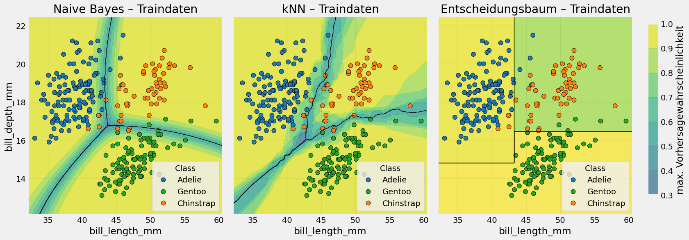
    


```python
X, y = pipeline(df, features=['bill_length_mm', 'bill_depth_mm'])
k = 10
cv_gnb = skfcv(gnb, X, y, k=k, random_seed=RANDOM_SEED, train_score=True)
cv_knn = skfcv(knn, X, y, k=k, random_seed=RANDOM_SEED, train_score=True)
cv_man = skfcv(man, X, y, k=k, random_seed=RANDOM_SEED, train_score=True)
```


```python
df_gnb = pd.DataFrame({
    "model": "GaussianNB",
    "accuracy": cv_gnb['cv']["test_accuracy"],
    "f1_macro": cv_gnb['cv']["test_f1_macro"],
    "precision_macro": cv_gnb['cv']["test_precision_macro"],
    "recall_macro": cv_gnb['cv']["test_recall_macro"]
})

df_knn = pd.DataFrame({
    "model": "KNN",
    "accuracy": cv_knn['cv']["test_accuracy"],
    "f1_macro": cv_knn['cv']["test_f1_macro"],
    "precision_macro": cv_knn['cv']["test_precision_macro"],
    "recall_macro": cv_knn['cv']["test_recall_macro"]
})

df_man = pd.DataFrame({
    "model": "MAN",
    "accuracy": cv_man['cv']["test_accuracy"],
    "f1_macro": cv_man['cv']["test_f1_macro"],
    "precision_macro": cv_man['cv']["test_precision_macro"],
    "recall_macro": cv_man['cv']["test_recall_macro"]
})

cv_df = pd.concat([df_gnb, df_knn, df_man], ignore_index=True)

plt.figure(figsize=(10, 6))
sns.boxplot(
    data=cv_df.melt(id_vars="model", var_name="metric", value_name="score"),
    x="metric",
    y="score",
    hue="model"
)
plt.title("Modellvergleich")
plt.xlabel("Metrik")
plt.ylabel("Score")
plt.legend(title="Model")
plt.show()
```


    
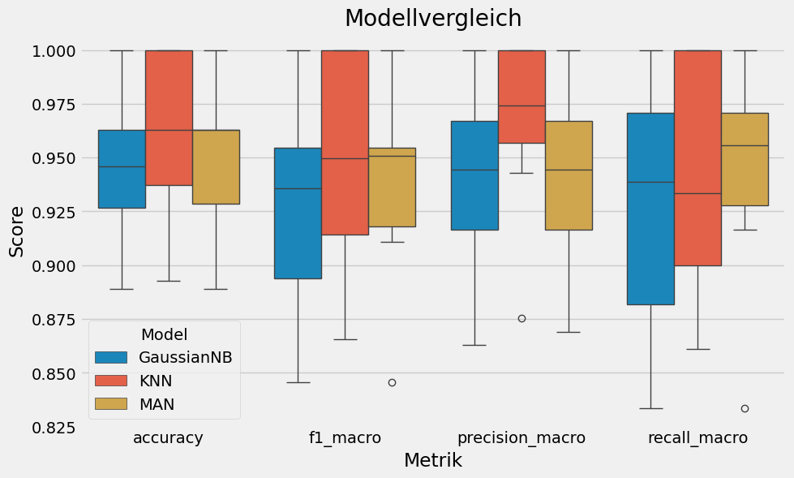
    


kNN schneidet am besten, der zweite Platz ist der manuelles Baum und GNB ist am niedrigsten. GNB ist sehr Biased wegen der Normalverteilungsannahme. Baum hat hauptsächlich einen Nachteil. Er gibt die gleiche Warhscheinlichkeit für die ganze Region, das führt dazu, dass die Punkte die sehr weit weg von der Entscheidungsgrenze liegen und eindeutig zu einer bestimmten Klasse gehören, werden trotzdem weniger Wahrscheinlichkeit zugeordnet bekommen, weil die Region allgmein weniger zuverlässlig angesehen ist. kNN hat diese beide Nachteile nicht, er findet die best mögliche Grenze (und gleichzeitig nicht overfittet) und für jeden Punkt eine bestimmte Wahrscheinlichkeit zuordnet, abhängig davon wie weit sie von der Entscheidungsgrenze liegen. Damit funktioniert es super. Und weil es nur 2 Features hat, kann es sogar als White Box Modell angesehen und einfach interpretiert werden. Dann hat es eigentlich nur einen einzigen Nachteil, dass es sehr langsam im Inferenz ist, weil es jedes mal alle Datenpunkte durchgehen muss, um eine Vorhersage zu treffen. Aber das ist nur problematisch wenn wir sehr sehr viele Datenpunkte haben. Damit wäre kNN eine klare Wahl.

Was wir auch beachten muss, ist, der Vergleich zwischen kNN und DT ist nicht zugerecht. Weil wir kNN komplette Freiheit gegeben haben und DT beschränkt manuell auf maximal 3 Splits. Wir haben ja davor gesehen, dass DT mit 4 Ebenen viel besser schneidet als von kNN. Deswegen wenn diese Kriterien wichtig sind, sollte eigentlich DT verwendet werden und zwar mit mindestens 4 Ebenen. Da wir aber absichtlich für einfachheit entschieden haben und ein einfacheres Modell bevorzugen, sind die Ergebnisse von manuellem DT gar nicht so schlecht. Ich würde daher trotzdem mit dem DT weiter gehen.


```python
cv_df.groupby("model").agg(["mean", "std"])
```


<div>
<style scoped>
    .dataframe tbody tr th:only-of-type {
        vertical-align: middle;
    }

    .dataframe tbody tr th {
        vertical-align: top;
    }

    .dataframe thead tr th {
        text-align: left;
    }

    .dataframe thead tr:last-of-type th {
        text-align: right;
    }
</style>
<table border="1" class="dataframe">
  <thead>
    <tr>
      <th></th>
      <th colspan="2" halign="left">accuracy</th>
      <th colspan="2" halign="left">f1_macro</th>
      <th colspan="2" halign="left">precision_macro</th>
      <th colspan="2" halign="left">recall_macro</th>
    </tr>
    <tr>
      <th></th>
      <th>mean</th>
      <th>std</th>
      <th>mean</th>
      <th>std</th>
      <th>mean</th>
      <th>std</th>
      <th>mean</th>
      <th>std</th>
    </tr>
    <tr>
      <th>model</th>
      <th></th>
      <th></th>
      <th></th>
      <th></th>
      <th></th>
      <th></th>
      <th></th>
      <th></th>
    </tr>
  </thead>
  <tbody>
    <tr>
      <th>GaussianNB</th>
      <td>0.945370</td>
      <td>0.039140</td>
      <td>0.929205</td>
      <td>0.052576</td>
      <td>0.937317</td>
      <td>0.047616</td>
      <td>0.930370</td>
      <td>0.057960</td>
    </tr>
    <tr>
      <th>KNN</th>
      <td>0.963624</td>
      <td>0.037936</td>
      <td>0.950626</td>
      <td>0.050333</td>
      <td>0.968891</td>
      <td>0.038944</td>
      <td>0.941667</td>
      <td>0.056489</td>
    </tr>
    <tr>
      <th>MAN</th>
      <td>0.952646</td>
      <td>0.034503</td>
      <td>0.940430</td>
      <td>0.045255</td>
      <td>0.942674</td>
      <td>0.040874</td>
      <td>0.945926</td>
      <td>0.048869</td>
    </tr>
  </tbody>
</table>
</div>


```python
cm_gnb = cv_gnb['cm']
cm_knn = cv_knn['cm']
cm_man = cv_man['cm']
classes = np.unique(y)
print("GaussianNB")
plot_confusion_matrix(cm_gnb, classes)
print("kNN")
plot_confusion_matrix(cm_knn, classes)
print("Entscheidungsbaum")
plot_confusion_matrix(cm_man, classes)
```

    GaussianNB


    

    


    kNN


    
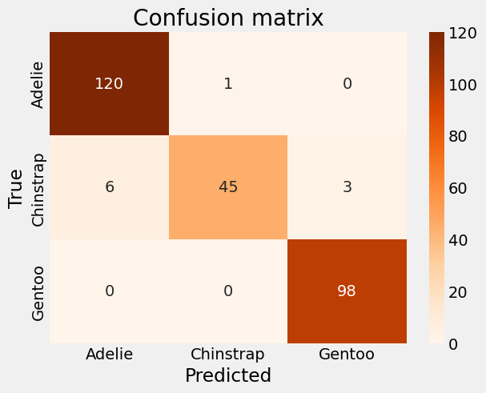
    


    Entscheidungsbaum


    
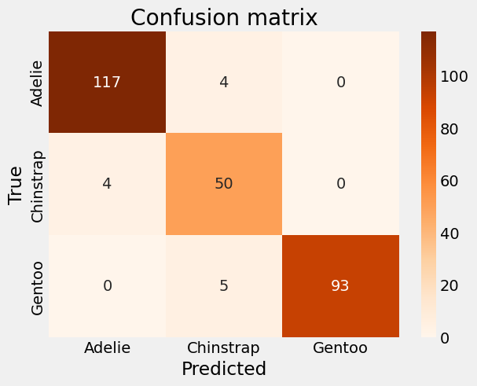
    


kNN hat Recall Probleme mit `Chinstrap` Klasse, also für Chinstrap Klasse ist sogar GNB besser.


```python
X, y = pipeline(df_test, features=['bill_length_mm', 'bill_depth_mm'])
y_pred = man.predict(X)
classes = np.unique(y)
print(classification_report(y, y_pred, digits=4))
cm_test = confusion_matrix(y, y_pred, labels=classes)
plot_confusion_matrix(cm_test, classes)
```

                  precision    recall  f1-score   support
    
          Adelie     0.9667    0.9667    0.9667        30
       Chinstrap     0.7500    0.8571    0.8000        14
          Gentoo     0.9565    0.8800    0.9167        25
    
        accuracy                         0.9130        69
       macro avg     0.8911    0.9013    0.8944        69
    weighted avg     0.9190    0.9130    0.9147        69
    


    
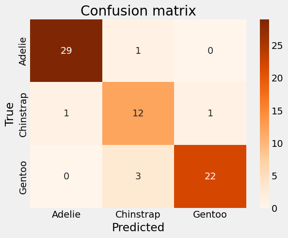
    


Dieses Ergebnis hätte ich schon erwartet. Wir hätten bestimmt bessere Ergebnisse bekommen, wenn wir ein voll potenzielles Baum oder sogar kNN verwendet hätten, aber wir sind mit dem Modell bereits zufrieden weil es uns diese schnelle Interpretierbarkeit liefert. Sowas würde man in Medizin Bereich bevorzugen über kNN Modell.


```python
X_train, y_train = pipeline(df, features=['bill_length_mm', 'bill_depth_mm'])
X_test, y_test = pipeline(df_test, features=['bill_length_mm', 'bill_depth_mm'])

cont, ax = plot_decision_surface(
    X_train, y_train,
    X_test_2d=X_test,
    y_test_2d=y_test,
    which_points="test",
    manual=True,
    manual_rules=manual_rules,
    get_leaf_masks=get_leaf_masks,
    model_name="Manuelles Modell"
)

fig = ax.get_figure()
fig.colorbar(cont, ax=ax, label="max. Blattwahrscheinlichkeit")
plt.show()
```


    
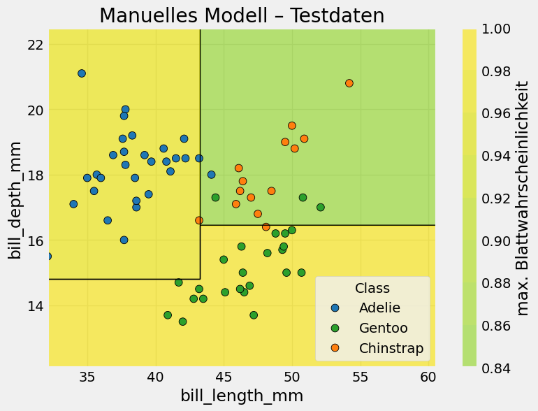
    


Unsere Testdaten haben genau dort Probleme, wo wir auch bei Trainingsdaten Probleme hatten. Das ist ganz Klare underfitting, weil wir dieses Muter lernen könnten wenn wir unser Modell nicht zu viel beschränkt hätten. Haben wir aber bewusst dafür entschieden.


```python
df_final = pd.concat([df, df_test])
X, y = pipeline(df_final, features=['bill_length_mm', 'bill_depth_mm'])
y_pred = man.predict(X)
cm = confusion_matrix(y, y_pred, labels=np.unique(y))
plot_confusion_matrix(cm, classes=np.unique(y), title='Confusion Matrix')
```


    
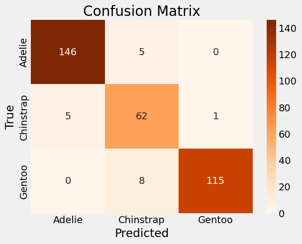
    


Hier können wir noch genauer anschauen, warum unser Modell bestimmte Fehler macht. z.B. warum sagt es `Chinstrap` wenn es tatsächlich `Adelie` ist.


```python
df_final['species_pred'] = np.nan
df_final['species_pred'] = df_final['species_pred'].fillna('Adelie').astype(object)
df_final.loc[X.index, 'species_pred'] = y_pred
df_final.head()
```


<div>
<style scoped>
    .dataframe tbody tr th:only-of-type {
        vertical-align: middle;
    }

    .dataframe tbody tr th {
        vertical-align: top;
    }

    .dataframe thead th {
        text-align: right;
    }
</style>
<table border="1" class="dataframe">
  <thead>
    <tr style="text-align: right;">
      <th></th>
      <th>island</th>
      <th>bill_length_mm</th>
      <th>bill_depth_mm</th>
      <th>flipper_length_mm</th>
      <th>body_mass_g</th>
      <th>sex</th>
      <th>species</th>
      <th>species_pred</th>
    </tr>
  </thead>
  <tbody>
    <tr>
      <th>98</th>
      <td>Dream</td>
      <td>33.1</td>
      <td>16.1</td>
      <td>178.0</td>
      <td>2900.0</td>
      <td>Female</td>
      <td>Adelie</td>
      <td>Adelie</td>
    </tr>
    <tr>
      <th>114</th>
      <td>Biscoe</td>
      <td>39.6</td>
      <td>20.7</td>
      <td>191.0</td>
      <td>3900.0</td>
      <td>Female</td>
      <td>Adelie</td>
      <td>Adelie</td>
    </tr>
    <tr>
      <th>118</th>
      <td>Torgersen</td>
      <td>35.7</td>
      <td>17.0</td>
      <td>189.0</td>
      <td>3350.0</td>
      <td>Female</td>
      <td>Adelie</td>
      <td>Adelie</td>
    </tr>
    <tr>
      <th>303</th>
      <td>Biscoe</td>
      <td>50.0</td>
      <td>15.9</td>
      <td>224.0</td>
      <td>5350.0</td>
      <td>Male</td>
      <td>Gentoo</td>
      <td>Gentoo</td>
    </tr>
    <tr>
      <th>343</th>
      <td>Biscoe</td>
      <td>49.9</td>
      <td>16.1</td>
      <td>213.0</td>
      <td>5400.0</td>
      <td>Male</td>
      <td>Gentoo</td>
      <td>Gentoo</td>
    </tr>
  </tbody>
</table>
</div>


```python
wrong_pred = df_final.loc[df_final.species != df_final.species_pred]
wrong_pred
```


<div>
<style scoped>
    .dataframe tbody tr th:only-of-type {
        vertical-align: middle;
    }

    .dataframe tbody tr th {
        vertical-align: top;
    }

    .dataframe thead th {
        text-align: right;
    }
</style>
<table border="1" class="dataframe">
  <thead>
    <tr style="text-align: right;">
      <th></th>
      <th>island</th>
      <th>bill_length_mm</th>
      <th>bill_depth_mm</th>
      <th>flipper_length_mm</th>
      <th>body_mass_g</th>
      <th>sex</th>
      <th>species</th>
      <th>species_pred</th>
    </tr>
  </thead>
  <tbody>
    <tr>
      <th>19</th>
      <td>Torgersen</td>
      <td>46.0</td>
      <td>21.5</td>
      <td>194.0</td>
      <td>4200.0</td>
      <td>Male</td>
      <td>Adelie</td>
      <td>Chinstrap</td>
    </tr>
    <tr>
      <th>285</th>
      <td>Biscoe</td>
      <td>49.8</td>
      <td>16.8</td>
      <td>230.0</td>
      <td>5700.0</td>
      <td>Male</td>
      <td>Gentoo</td>
      <td>Chinstrap</td>
    </tr>
    <tr>
      <th>319</th>
      <td>Biscoe</td>
      <td>51.1</td>
      <td>16.5</td>
      <td>225.0</td>
      <td>5250.0</td>
      <td>Male</td>
      <td>Gentoo</td>
      <td>Chinstrap</td>
    </tr>
    <tr>
      <th>206</th>
      <td>Dream</td>
      <td>42.5</td>
      <td>17.3</td>
      <td>187.0</td>
      <td>3350.0</td>
      <td>Female</td>
      <td>Chinstrap</td>
      <td>Adelie</td>
    </tr>
    <tr>
      <th>184</th>
      <td>Dream</td>
      <td>42.5</td>
      <td>16.7</td>
      <td>187.0</td>
      <td>3350.0</td>
      <td>Female</td>
      <td>Chinstrap</td>
      <td>Adelie</td>
    </tr>
    <tr>
      <th>73</th>
      <td>Torgersen</td>
      <td>45.8</td>
      <td>18.9</td>
      <td>197.0</td>
      <td>4150.0</td>
      <td>Male</td>
      <td>Adelie</td>
      <td>Chinstrap</td>
    </tr>
    <tr>
      <th>182</th>
      <td>Dream</td>
      <td>40.9</td>
      <td>16.6</td>
      <td>187.0</td>
      <td>3200.0</td>
      <td>Female</td>
      <td>Chinstrap</td>
      <td>Adelie</td>
    </tr>
    <tr>
      <th>43</th>
      <td>Dream</td>
      <td>44.1</td>
      <td>19.7</td>
      <td>196.0</td>
      <td>4400.0</td>
      <td>Male</td>
      <td>Adelie</td>
      <td>Chinstrap</td>
    </tr>
    <tr>
      <th>321</th>
      <td>Biscoe</td>
      <td>55.9</td>
      <td>17.0</td>
      <td>228.0</td>
      <td>5600.0</td>
      <td>Male</td>
      <td>Gentoo</td>
      <td>Chinstrap</td>
    </tr>
    <tr>
      <th>111</th>
      <td>Biscoe</td>
      <td>45.6</td>
      <td>20.3</td>
      <td>191.0</td>
      <td>4600.0</td>
      <td>Male</td>
      <td>Adelie</td>
      <td>Chinstrap</td>
    </tr>
    <tr>
      <th>339</th>
      <td>Biscoe</td>
      <td>NaN</td>
      <td>NaN</td>
      <td>NaN</td>
      <td>NaN</td>
      <td>NaN</td>
      <td>Gentoo</td>
      <td>Adelie</td>
    </tr>
    <tr>
      <th>253</th>
      <td>Biscoe</td>
      <td>59.6</td>
      <td>17.0</td>
      <td>230.0</td>
      <td>6050.0</td>
      <td>Male</td>
      <td>Gentoo</td>
      <td>Chinstrap</td>
    </tr>
    <tr>
      <th>172</th>
      <td>Dream</td>
      <td>42.4</td>
      <td>17.3</td>
      <td>181.0</td>
      <td>3600.0</td>
      <td>Female</td>
      <td>Chinstrap</td>
      <td>Adelie</td>
    </tr>
    <tr>
      <th>311</th>
      <td>Biscoe</td>
      <td>52.2</td>
      <td>17.1</td>
      <td>228.0</td>
      <td>5400.0</td>
      <td>Male</td>
      <td>Gentoo</td>
      <td>Chinstrap</td>
    </tr>
    <tr>
      <th>305</th>
      <td>Biscoe</td>
      <td>50.8</td>
      <td>17.3</td>
      <td>228.0</td>
      <td>5600.0</td>
      <td>Male</td>
      <td>Gentoo</td>
      <td>Chinstrap</td>
    </tr>
    <tr>
      <th>257</th>
      <td>Biscoe</td>
      <td>44.4</td>
      <td>17.3</td>
      <td>219.0</td>
      <td>5250.0</td>
      <td>Male</td>
      <td>Gentoo</td>
      <td>Chinstrap</td>
    </tr>
    <tr>
      <th>174</th>
      <td>Dream</td>
      <td>43.2</td>
      <td>16.6</td>
      <td>187.0</td>
      <td>2900.0</td>
      <td>Female</td>
      <td>Chinstrap</td>
      <td>Adelie</td>
    </tr>
    <tr>
      <th>129</th>
      <td>Torgersen</td>
      <td>44.1</td>
      <td>18.0</td>
      <td>210.0</td>
      <td>4000.0</td>
      <td>Male</td>
      <td>Adelie</td>
      <td>Chinstrap</td>
    </tr>
    <tr>
      <th>202</th>
      <td>Dream</td>
      <td>48.1</td>
      <td>16.4</td>
      <td>199.0</td>
      <td>3325.0</td>
      <td>Female</td>
      <td>Chinstrap</td>
      <td>Gentoo</td>
    </tr>
    <tr>
      <th>309</th>
      <td>Biscoe</td>
      <td>52.1</td>
      <td>17.0</td>
      <td>230.0</td>
      <td>5550.0</td>
      <td>Male</td>
      <td>Gentoo</td>
      <td>Chinstrap</td>
    </tr>
  </tbody>
</table>
</div>


```python
chinstrap_not_adelie_idx = wrong_pred[(wrong_pred.species == 'Adelie') & (wrong_pred.species_pred == 'Chinstrap')].index.to_list()
```


```python
man.fit(X, y)
explainer = shap.ExactExplainer(man.predict_proba, X)
shap_values = explainer(X)
shap_values.shape
```


    (342, 2, 3)


```python
classes = list(np.unique(y))
i = chinstrap_not_adelie_idx[1]
class_actual = wrong_pred.loc[i, 'species']
actual_idx = classes.index(class_actual)
class_predicted = wrong_pred.loc[i, 'species_pred']
predicted_idx = classes.index(class_predicted)
pos = X.index.get_loc(i)
print(f"{i=}, {pos=}, {class_actual=}, {class_predicted=}")
shap.plots.waterfall(shap_values[pos, :, actual_idx])
shap.plots.waterfall(shap_values[pos, :, predicted_idx])
```

    i=73, pos=67, class_actual='Adelie', class_predicted='Chinstrap'


    
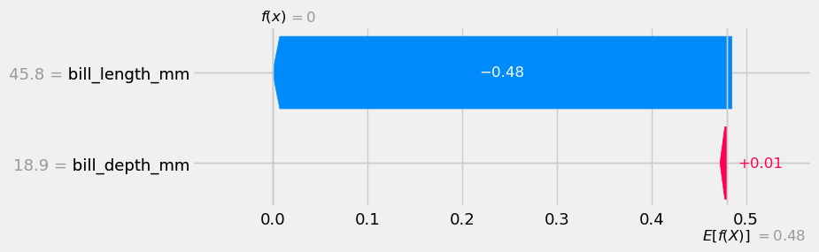
    


    
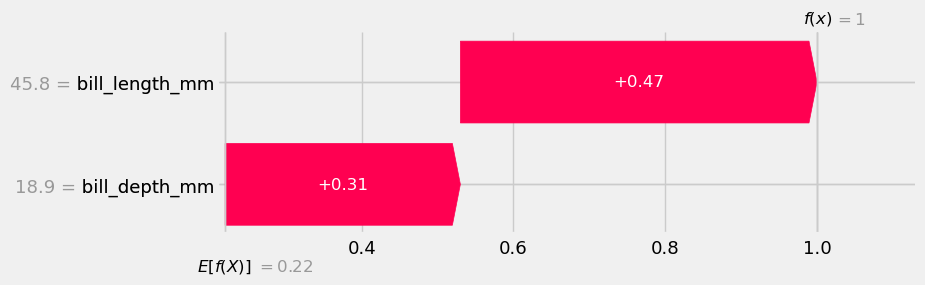
    


Wir sehen hier, `bill_length_mm` ist eindeutig für diese falsche Vorhersage verantwortlich. Weil der Wert von diesem Feature verringert die Warhscheinlichkeit für die richtige Klasse um 48%.


```python
red = "#FF0051"
blue = "#008BFB"
palette = [blue, red]
fig, axes = plt.subplots(1, 3, figsize=(18, 5), sharey=True)
x = "bill_length_mm"
sns.boxplot(data=df_final.loc[df_final.species != 'Gentoo'], x=x, y='species', hue='species', palette=palette, ax=axes[0]);
axes[0].axvline(x=df_final.loc[i, x], color=red);

x = "bill_depth_mm"
sns.boxplot(data=df_final.loc[df_final.species != 'Gentoo'], x=x, y='species', hue='species', palette=palette, ax=axes[1]);
axes[1].axvline(x=df_final.loc[i, x], color=red);

x = "flipper_length_mm"
sns.boxplot(data=df_final.loc[df_final.species != 'Gentoo'], x=x, y='species', hue='species', palette=palette, ax=axes[2]);
axes[2].axvline(x=df_final.loc[i, x], color=red);

plt.tight_layout()
plt.show()
```


    
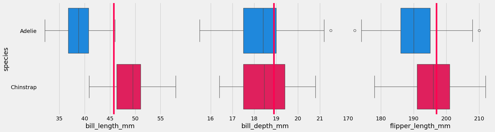
    


Hier sehen wir, dass der Wert von `bill_length_mm` sehr nah an `Chinstrap` Cluster liegt als an `Adelie` Cluster. Also unser Modell hat tatsächlich richtig gemacht, weil wir hätten intuitiv auch das gleiche gesagt. Man könnte überlegen ob ein anderes Feature wie `flipper_length_mm` könnte dieses Problem lösen, aber wir sehen auf dem rechten Plot, dass sogar für dieses Feature liegt der Wert nah an `Chinstrap` als an `Adelie`. Das könnte sogar einen Hinweis sein, dass der Label falsch sein könnte. 
